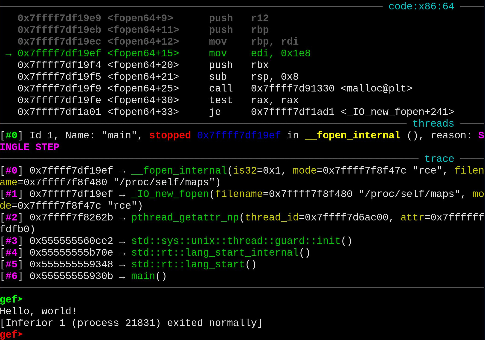
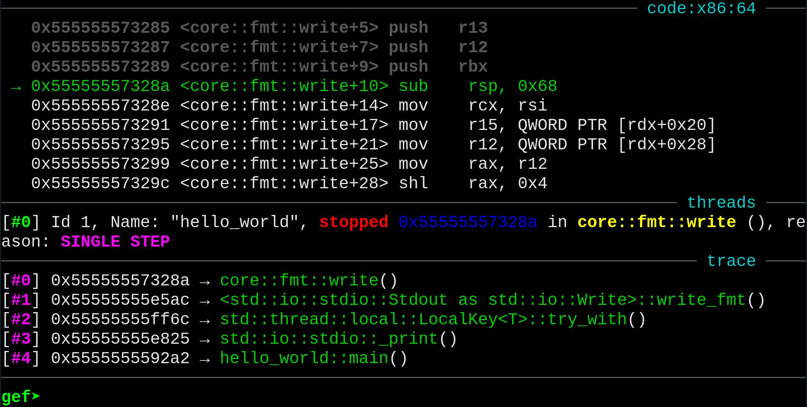
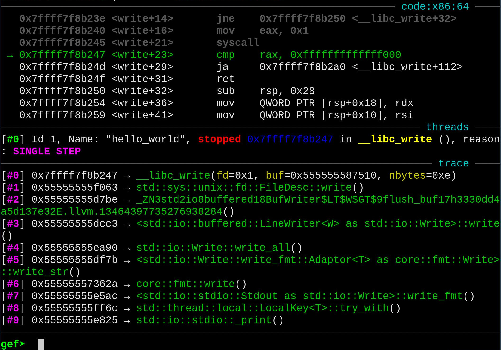

## Rust to Binary

I'm not going to go too deep into the basics of Rust, there is a great resource [here](https://doc.rust-lang.org/1.30.0/book/first-edition/getting-started.html), which will help you getting started with Rust. We are going to start from a simple examlpe with the assumption that you know the bare minimum of Rust and are familiar with reverse engineering binaries. This article only covers the places where I feel reversing a Rust binary differs from c binary, if you have familiarity with reversing c++ binaries you will likely be able to skip to the end.

<p>

Start by building your first Rust project with:

```bash
  $ cargo new hello_world --bin
```

Which produces the source code:

```rust
  fn main() {
      println!("Hello, world!");
  }
```

And can be compiled with:

```bash
  $ cargo build
```


</p>

## Examining symbols

When we use `nm` on the binary produced by the build we see that it produces a list of symbols we can examine.

```nm
  ...
                   U writev@@GLIBC_2.2.5
                   U __xpg_strerror_r@@GLIBC_2.3.4
  0000000000005270 t _ZN11hello_world4main17hb5a7b00b6473ee4dE
  000000000000ec70 t _ZN12panic_unwind3imp14find_eh_action28_$u7b$$u7b$closure$u7d$$u7d$17h01c912f154f734c1E
  ...
```

We are most interested in the symbol `_ZN11hello_world4main17hb5a7b00b6473ee4dE`. We can demangle each reference with a c++ tool called `c++filt`, which will tell us that the symbol refers to `hello_world::main`.

```shell
  $ c++filt _ZN11hello_world4main17hb5a7b00b6473ee4dE
  hello_world::main

```
<details><summary>_ZN8blahblahE explained</summary>
<p>

Simply put `_ZN11hello_world4main17hb5a7b00b6473ee4dE` consists of the numeric length of a string and the string itself. `hello_world` is 11 charachters, `main` is 4, with the default delimiter `::`. And `hb5a7b00b6473ee4d` is 17 bytes, with `E` as the **`EOL`**.

<p>
</details>

<details><summary>full `nm` output</summary>
<p>

```nm
$ nm target/debug/hello_world
00000000000136b0 t abbrev_compare
                 U abort@@GLIBC_2.2.5
0000000000014bb0 t add_function_range.isra.0
0000000000014b00 t add_line.isra.0
00000000000136d0 t add_unit_addr
0000000000013870 t advance.part.0
0000000000031040 D anon.06f3b36a0fb3673c2f7c66bd3b539142.48.llvm.3617607378679464731
0000000000026cf2 R anon.089730133c12fa7217617d8f93ba7d2b.16.llvm.9821149168950303654
0000000000026cf5 R anon.089730133c12fa7217617d8f93ba7d2b.17.llvm.9821149168950303654
0000000000026cf7 R anon.089730133c12fa7217617d8f93ba7d2b.18.llvm.9821149168950303654
0000000000026cf9 R anon.089730133c12fa7217617d8f93ba7d2b.19.llvm.9821149168950303654
0000000000026cfb R anon.089730133c12fa7217617d8f93ba7d2b.20.llvm.9821149168950303654
0000000000026cfe R anon.089730133c12fa7217617d8f93ba7d2b.21.llvm.9821149168950303654
0000000000026cff R anon.089730133c12fa7217617d8f93ba7d2b.22.llvm.9821149168950303654
0000000000026d01 R anon.089730133c12fa7217617d8f93ba7d2b.23.llvm.9821149168950303654
0000000000026d03 R anon.089730133c12fa7217617d8f93ba7d2b.24.llvm.9821149168950303654
0000000000026d04 R anon.089730133c12fa7217617d8f93ba7d2b.25.llvm.9821149168950303654
0000000000026d05 R anon.089730133c12fa7217617d8f93ba7d2b.26.llvm.9821149168950303654
0000000000026d06 R anon.089730133c12fa7217617d8f93ba7d2b.27.llvm.9821149168950303654
0000000000026d07 R anon.089730133c12fa7217617d8f93ba7d2b.29.llvm.9821149168950303654
0000000000026d08 R anon.089730133c12fa7217617d8f93ba7d2b.33.llvm.9821149168950303654
00000000000316c8 D anon.089730133c12fa7217617d8f93ba7d2b.43.llvm.9821149168950303654
00000000000316e0 D anon.089730133c12fa7217617d8f93ba7d2b.44.llvm.9821149168950303654
00000000000316f8 D anon.089730133c12fa7217617d8f93ba7d2b.45.llvm.9821149168950303654
0000000000031710 D anon.089730133c12fa7217617d8f93ba7d2b.46.llvm.9821149168950303654
0000000000031728 D anon.089730133c12fa7217617d8f93ba7d2b.47.llvm.9821149168950303654
0000000000031740 D anon.089730133c12fa7217617d8f93ba7d2b.48.llvm.9821149168950303654
0000000000025bb2 R anon.1a328cb1f790579e122af0343cdbeecc.6.llvm.3221381995650050996
0000000000030578 D anon.20af00befe3dd4171761ec1e1c23bf16.10.llvm.14722412125050928257
0000000000030598 D anon.20af00befe3dd4171761ec1e1c23bf16.11.llvm.14722412125050928257
00000000000305b8 D anon.20af00befe3dd4171761ec1e1c23bf16.12.llvm.14722412125050928257
0000000000023c67 R anon.20af00befe3dd4171761ec1e1c23bf16.18.llvm.14722412125050928257
00000000000305d8 D anon.20af00befe3dd4171761ec1e1c23bf16.30.llvm.14722412125050928257
0000000000023cba R anon.20af00befe3dd4171761ec1e1c23bf16.31.llvm.14722412125050928257
0000000000030530 D anon.20af00befe3dd4171761ec1e1c23bf16.3.llvm.14722412125050928257
00000000000305f0 D anon.20af00befe3dd4171761ec1e1c23bf16.40.llvm.14722412125050928257
0000000000023d14 R anon.20af00befe3dd4171761ec1e1c23bf16.41.llvm.14722412125050928257
0000000000023bf4 R anon.20af00befe3dd4171761ec1e1c23bf16.5.llvm.14722412125050928257
0000000000023c04 R anon.20af00befe3dd4171761ec1e1c23bf16.6.llvm.14722412125050928257
0000000000025f53 R anon.3dff7bba8de4c451c54abbbb6bc2ef3f.46.llvm.235460764318738879
0000000000025fa5 R anon.3dff7bba8de4c451c54abbbb6bc2ef3f.47.llvm.235460764318738879
00000000000260ca R anon.3dff7bba8de4c451c54abbbb6bc2ef3f.48.llvm.235460764318738879
0000000000026204 R anon.3dff7bba8de4c451c54abbbb6bc2ef3f.49.llvm.235460764318738879
000000000002624a R anon.3dff7bba8de4c451c54abbbb6bc2ef3f.50.llvm.235460764318738879
00000000000262f0 R anon.3dff7bba8de4c451c54abbbb6bc2ef3f.51.llvm.235460764318738879
0000000000030c10 D anon.5184c9c94e2b15172d042a5888b7f0e6.6.llvm.4578759908112325694
00000000000304a8 D anon.571b1fc9e613c4e007171b911e6dc0a1.0.llvm.8703683633474549298
00000000000304d8 D anon.571b1fc9e613c4e007171b911e6dc0a1.5.llvm.8703683633474549298
0000000000030508 D anon.571b1fc9e613c4e007171b911e6dc0a1.7.llvm.8703683633474549298
0000000000030518 D anon.571b1fc9e613c4e007171b911e6dc0a1.8.llvm.8703683633474549298
00000000000235aa R anon.615bb761a9fbe17bc4f14d83fbc8ac10.10.llvm.13464397735276938284
0000000000030348 D anon.615bb761a9fbe17bc4f14d83fbc8ac10.31.llvm.13464397735276938284
0000000000023701 R anon.615bb761a9fbe17bc4f14d83fbc8ac10.32.llvm.13464397735276938284
0000000000030258 D anon.615bb761a9fbe17bc4f14d83fbc8ac10.5.llvm.13464397735276938284
000000000002357f R anon.615bb761a9fbe17bc4f14d83fbc8ac10.7.llvm.13464397735276938284
00000000000302a0 D anon.615bb761a9fbe17bc4f14d83fbc8ac10.8.llvm.13464397735276938284
0000000000030380 D anon.61e658ef6d126053252eeff2ac369bfc.15.llvm.7408383674114746665
0000000000030410 D anon.61e658ef6d126053252eeff2ac369bfc.37.llvm.7408383674114746665
0000000000030418 D anon.61e658ef6d126053252eeff2ac369bfc.55.llvm.7408383674114746665
0000000000023a22 R anon.61e658ef6d126053252eeff2ac369bfc.56.llvm.7408383674114746665
00000000000309b0 D anon.64f20fb2b35696e33e6bfd3d81c9b7a1.2.llvm.15546015952955963599
0000000000030908 D anon.66967ab49e082e229e927a866b98a119.11.llvm.13299720880406537282
0000000000023ffe R anon.66967ab49e082e229e927a866b98a119.15.llvm.13299720880406537282
000000000002400c R anon.66967ab49e082e229e927a866b98a119.16.llvm.13299720880406537282
0000000000024010 R anon.66967ab49e082e229e927a866b98a119.17.llvm.13299720880406537282
00000000000308e0 D anon.66967ab49e082e229e927a866b98a119.8.llvm.13299720880406537282
00000000000259a5 R anon.8665b36fbc3e07b4b6ff35be648ce3df.2.llvm.3712589730771029109
000000000002353c R anon.8ddcb3e6cdeb75a256e0761cba0dd47b.0.llvm.16905710976659750015
000000000002353e R anon.8ddcb3e6cdeb75a256e0761cba0dd47b.2.llvm.16905710976659750015
0000000000030a60 D anon.b3c93e03595a8198d9ad0a4d166235ba.2.llvm.9535220708313256981
00000000000232b2 R anon.d1ca5ee604450711f839ff92e0c1c341.4.llvm.15251854126160160905
00000000000300e0 D anon.d1ca5ee604450711f839ff92e0c1c341.52.llvm.15251854126160160905
0000000000030180 D anon.d1ca5ee604450711f839ff92e0c1c341.69.llvm.15251854126160160905
0000000000030088 D anon.d1ca5ee604450711f839ff92e0c1c341.6.llvm.15251854126160160905
00000000000301a0 D anon.d1ca5ee604450711f839ff92e0c1c341.72.llvm.15251854126160160905
000000000002343c R anon.d1ca5ee604450711f839ff92e0c1c341.73.llvm.15251854126160160905
00000000000301e0 D anon.d1ca5ee604450711f839ff92e0c1c341.95.llvm.15251854126160160905
0000000000023480 R anon.d1ca5ee604450711f839ff92e0c1c341.96.llvm.15251854126160160905
0000000000030fe0 D anon.d30831f3488f9b216ba236cb8565ef27.9.llvm.689403275060108414
000000000002fdd8 D anon.dcd23e8baa7f711878d5fc85d3ee8919.25.llvm.16068065643866689459
000000000002fed8 D anon.dcd23e8baa7f711878d5fc85d3ee8919.42.llvm.16068065643866689459
0000000000030048 D anon.dcd23e8baa7f711878d5fc85d3ee8919.84.llvm.16068065643866689459
000000000002324b R anon.dcd23e8baa7f711878d5fc85d3ee8919.85.llvm.16068065643866689459
0000000000030870 D anon.dead67312ebd92c87a8a5945f13fb94d.29.llvm.6427174176799064609
0000000000023f3c R anon.dead67312ebd92c87a8a5945f13fb94d.30.llvm.6427174176799064609
00000000000307d0 D anon.dead67312ebd92c87a8a5945f13fb94d.4.llvm.6427174176799064609
0000000000030820 D anon.dead67312ebd92c87a8a5945f13fb94d.9.llvm.6427174176799064609
000000000002406c R anon.f50421931c6c96c5a581a6db23b7e6cb.3.llvm.18113466118128623723
0000000000030430 D anon.f72a734e98f65bcdd85b0041a440400a.2.llvm.7143059675557422788
0000000000030458 D anon.f72a734e98f65bcdd85b0041a440400a.4.llvm.7143059675557422788
0000000000030480 D anon.f72a734e98f65bcdd85b0041a440400a.5.llvm.7143059675557422788
                 U bcmp@@GLIBC_2.2.5
0000000000032038 B __bss_start
                 U close@@GLIBC_2.2.5
0000000000032038 b completed.8055
00000000000246c0 r crc32_table.5726
                 w __cxa_finalize@@GLIBC_2.2.5
                 w __cxa_thread_atexit_impl@@GLIBC_2.18
000000000002fd00 d debug_section_names
00000000000051b0 t deregister_tm_clones
0000000000022810 T __divti3
                 U dladdr@@GLIBC_2.2.5
                 U dl_iterate_phdr@@GLIBC_2.2.5
0000000000005220 t __do_global_dtors_aux
000000000002fcf8 d __do_global_dtors_aux_fini_array_entry
0000000000032000 D __dso_handle
0000000000013780 t dwarf_buf_error
0000000000016bb0 t dwarf_fileline
0000000000005169 t dwarf_fileline.cold
0000000000015600 t dwarf_lookup_pc
0000000000005164 t dwarf_lookup_pc.cold
0000000000032008 V DW.ref.rust_eh_personality
0000000000031780 d _DYNAMIC
0000000000032038 D _edata
0000000000011ce0 t elf_add
000000000000515a t elf_add.cold
0000000000010510 t elf_nodebug
0000000000010530 t elf_nosyms
0000000000010550 t elf_symbol_compare
0000000000010570 t elf_syminfo
0000000000005155 t elf_syminfo.cold
0000000000010620 t elf_try_debugfile
0000000000011c50 t elf_uncompress_zdebug.part.0
0000000000024ac0 r elf_zlib_default_dist_table
0000000000024cc0 r elf_zlib_default_table
0000000000010be0 t elf_zlib_inflate_and_verify
0000000000010750 t elf_zlib_inflate_table
00000000000321d8 B _end
                 U __errno_location@@GLIBC_2.2.5
00000000000100e0 t fileline_initialize
0000000000005150 t fileline_initialize.cold
0000000000014360 t find_address_ranges
0000000000022928 T _fini
0000000000005260 t frame_dummy
000000000002fcf0 d __frame_dummy_init_array_entry
000000000002cc1c r __FRAME_END__
0000000000016c80 t free_abbrevs.isra.0
                 U free@@GLIBC_2.2.5
0000000000013800 t free_line_header
0000000000014c60 t function_addrs_compare
                 U __fxstat@@GLIBC_2.2.5
000000000002e2e4 r GCC_except_table0
000000000002cc20 r GCC_except_table1
000000000002d1dc r GCC_except_table1
000000000002cc44 r GCC_except_table10
000000000002ce90 r GCC_except_table10
000000000002d5b4 r GCC_except_table100
000000000002d750 r GCC_except_table100
000000000002e0d4 r GCC_except_table100
000000000002e0e4 r GCC_except_table101
000000000002d768 r GCC_except_table102
000000000002e100 r GCC_except_table105
000000000002d778 r GCC_except_table106
000000000002d78c r GCC_except_table107
000000000002d7a0 r GCC_except_table108
000000000002d7b4 r GCC_except_table109
000000000002d7c8 r GCC_except_table110
000000000002dfa8 r GCC_except_table112
000000000002dfbc r GCC_except_table113
000000000002e110 r GCC_except_table114
000000000002d7ec r GCC_except_table115
000000000002d804 r GCC_except_table116
000000000002e2a4 r GCC_except_table116
000000000002d81c r GCC_except_table117
000000000002d860 r GCC_except_table118
000000000002d8a4 r GCC_except_table119
000000000002e120 r GCC_except_table119
000000000002db1c r GCC_except_table12
000000000002d8d0 r GCC_except_table120
000000000002dd50 r GCC_except_table120
000000000002ccd0 r GCC_except_table125
000000000002da5c r GCC_except_table125
000000000002da80 r GCC_except_table126
000000000002d078 r GCC_except_table129
000000000002db28 r GCC_except_table13
000000000002d084 r GCC_except_table132
000000000002cd04 r GCC_except_table135
000000000002cd18 r GCC_except_table139
000000000002d218 r GCC_except_table14
000000000002da94 r GCC_except_table148
000000000002daac r GCC_except_table149
000000000002cc50 r GCC_except_table15
000000000002dd8c r GCC_except_table15
000000000002d098 r GCC_except_table150
000000000002dac0 r GCC_except_table150
000000000002cd30 r GCC_except_table153
000000000002d900 r GCC_except_table154
000000000002dad8 r GCC_except_table154
000000000002d0e0 r GCC_except_table155
000000000002d910 r GCC_except_table155
000000000002dafc r GCC_except_table155
000000000002d0f4 r GCC_except_table157
000000000002d100 r GCC_except_table158
000000000002d93c r GCC_except_table158
000000000002d954 r GCC_except_table159
000000000002d228 r GCC_except_table16
000000000002cd64 r GCC_except_table160
000000000002cd78 r GCC_except_table161
000000000002d128 r GCC_except_table162
000000000002dfd0 r GCC_except_table162
000000000002dfe8 r GCC_except_table163
000000000002d154 r GCC_except_table164
000000000002cd90 r GCC_except_table165
000000000002cda0 r GCC_except_table166
000000000002db34 r GCC_except_table17
000000000002d970 r GCC_except_table172
000000000002d988 r GCC_except_table174
000000000002dffc r GCC_except_table174
000000000002cdc0 r GCC_except_table175
000000000002d9c4 r GCC_except_table175
000000000002d170 r GCC_except_table176
000000000002cddc r GCC_except_table177
000000000002d9d8 r GCC_except_table177
000000000002ce20 r GCC_except_table178
000000000002d184 r GCC_except_table178
000000000002e018 r GCC_except_table179
000000000002cc5c r GCC_except_table18
000000000002def0 r GCC_except_table18
000000000002d1ac r GCC_except_table183
000000000002ce50 r GCC_except_table185
000000000002ce64 r GCC_except_table186
000000000002ce74 r GCC_except_table187
000000000002ce84 r GCC_except_table192
000000000002d1f0 r GCC_except_table2
000000000002e2c0 r GCC_except_table2
000000000002d1c8 r GCC_except_table206
000000000002ddac r GCC_except_table21
000000000002defc r GCC_except_table21
000000000002d9e4 r GCC_except_table218
000000000002cc68 r GCC_except_table22
000000000002ce9c r GCC_except_table22
000000000002ddb8 r GCC_except_table22
000000000002d5d0 r GCC_except_table23
000000000002dde4 r GCC_except_table23
000000000002d5dc r GCC_except_table24
000000000002de10 r GCC_except_table24
000000000002e024 r GCC_except_table24
000000000002de30 r GCC_except_table25
000000000002cea8 r GCC_except_table26
000000000002d234 r GCC_except_table28
000000000002e030 r GCC_except_table28
000000000002d204 r GCC_except_table3
000000000002cc74 r GCC_except_table30
000000000002ceb4 r GCC_except_table30
000000000002df08 r GCC_except_table30
000000000002cc80 r GCC_except_table31
000000000002e03c r GCC_except_table37
000000000002e144 r GCC_except_table37
000000000002db40 r GCC_except_table38
000000000002e168 r GCC_except_table38
000000000002de50 r GCC_except_table39
000000000002e31c r GCC_except_table4
000000000002d240 r GCC_except_table42
000000000002db60 r GCC_except_table42
000000000002d250 r GCC_except_table43
000000000002db80 r GCC_except_table43
000000000002d260 r GCC_except_table44
000000000002dbb0 r GCC_except_table44
000000000002dbcc r GCC_except_table45
000000000002dbe8 r GCC_except_table46
000000000002dc18 r GCC_except_table47
000000000002dc44 r GCC_except_table49
000000000002d270 r GCC_except_table50
000000000002d5ec r GCC_except_table50
000000000002e178 r GCC_except_table50
000000000002df14 r GCC_except_table51
000000000002e190 r GCC_except_table51
000000000002dc6c r GCC_except_table52
000000000002df24 r GCC_except_table52
000000000002d280 r GCC_except_table54
000000000002e048 r GCC_except_table54
000000000002da14 r GCC_except_table55
000000000002e1a8 r GCC_except_table55
000000000002d2ec r GCC_except_table56
000000000002da2c r GCC_except_table56
000000000002d364 r GCC_except_table57
000000000002df30 r GCC_except_table57
000000000002cec0 r GCC_except_table58
000000000002d38c r GCC_except_table58
000000000002df44 r GCC_except_table58
000000000002dd80 r GCC_except_table6
000000000002e138 r GCC_except_table6
000000000002cee4 r GCC_except_table60
000000000002cf40 r GCC_except_table61
000000000002dcdc r GCC_except_table66
000000000002de5c r GCC_except_table66
000000000002e1c0 r GCC_except_table66
000000000002dcec r GCC_except_table67
000000000002dcf8 r GCC_except_table68
000000000002de74 r GCC_except_table68
000000000002dd04 r GCC_except_table69
000000000002e1d4 r GCC_except_table69
000000000002e2cc r GCC_except_table7
000000000002cf70 r GCC_except_table70
000000000002df78 r GCC_except_table70
000000000002e204 r GCC_except_table71
000000000002df90 r GCC_except_table72
000000000002cfb0 r GCC_except_table73
000000000002da3c r GCC_except_table73
000000000002cfe0 r GCC_except_table74
000000000002d5f8 r GCC_except_table74
000000000002da50 r GCC_except_table74
000000000002cfec r GCC_except_table76
000000000002d3a0 r GCC_except_table76
000000000002dd10 r GCC_except_table76
000000000002e058 r GCC_except_table76
000000000002d608 r GCC_except_table77
000000000002d3cc r GCC_except_table78
000000000002d61c r GCC_except_table79
000000000002cc2c r GCC_except_table8
000000000002db10 r GCC_except_table8
000000000002e300 r GCC_except_table8
000000000002d3dc r GCC_except_table80
000000000002d630 r GCC_except_table80
000000000002dd1c r GCC_except_table80
000000000002d644 r GCC_except_table81
000000000002cff8 r GCC_except_table82
000000000002d3f8 r GCC_except_table82
000000000002d658 r GCC_except_table82
000000000002e070 r GCC_except_table82
000000000002cc8c r GCC_except_table83
000000000002d024 r GCC_except_table83
000000000002d408 r GCC_except_table83
000000000002d66c r GCC_except_table83
000000000002cca4 r GCC_except_table84
000000000002d038 r GCC_except_table84
000000000002d418 r GCC_except_table84
000000000002ccbc r GCC_except_table85
000000000002d428 r GCC_except_table86
000000000002e244 r GCC_except_table86
000000000002d050 r GCC_except_table87
000000000002d48c r GCC_except_table87
000000000002dd30 r GCC_except_table87
000000000002e07c r GCC_except_table87
000000000002d4ac r GCC_except_table88
000000000002d4cc r GCC_except_table89
000000000002d6a8 r GCC_except_table89
000000000002dd3c r GCC_except_table89
000000000002cc38 r GCC_except_table9
000000000002d5c4 r GCC_except_table9
000000000002e2d8 r GCC_except_table9
000000000002e310 r GCC_except_table9
000000000002d508 r GCC_except_table90
000000000002e270 r GCC_except_table90
000000000002d064 r GCC_except_table91
000000000002d544 r GCC_except_table91
000000000002e08c r GCC_except_table92
000000000002d6b8 r GCC_except_table93
000000000002e0a8 r GCC_except_table93
000000000002d574 r GCC_except_table94
000000000002d6d4 r GCC_except_table94
000000000002d584 r GCC_except_table95
000000000002d6e8 r GCC_except_table95
000000000002d594 r GCC_except_table96
000000000002d6fc r GCC_except_table96
000000000002e0b8 r GCC_except_table96
000000000002d710 r GCC_except_table97
000000000002e0c8 r GCC_except_table97
000000000002d5a4 r GCC_except_table98
000000000002d734 r GCC_except_table98
000000000002e288 r GCC_except_table98
000000000002d740 r GCC_except_table99
                 U getcwd@@GLIBC_2.2.5
                 U getenv@@GLIBC_2.2.5
                 U getpid@@GLIBC_2.2.5
00000000000319b0 d _GLOBAL_OFFSET_TABLE_
                 w __gmon_start__
0000000000026d90 r __GNU_EH_FRAME_HDR
0000000000005000 t _init
000000000002fcf8 d __init_array_end
000000000002fcf0 d __init_array_start
                 w _ITM_deregisterTMCloneTable
                 w _ITM_registerTMCloneTable
0000000000022920 T __libc_csu_fini
00000000000228b0 T __libc_csu_init
                 U __libc_start_main@@GLIBC_2.2.5
0000000000014040 t line_compare
0000000000014070 t lookup_abbrev.isra.0
                 U lseek@@GLIBC_2.2.5
00000000000052b0 T main
                 U malloc@@GLIBC_2.2.5
                 U memchr@@GLIBC_2.2.5
                 U memcpy@@GLIBC_2.14
                 U memmove@@GLIBC_2.2.5
                 U memrchr@@GLIBC_2.2.5
                 U memset@@GLIBC_2.2.5
                 U mmap@@GLIBC_2.2.5
0000000000022860 T __modti3
00000000000227b0 T __multi3
                 U munmap@@GLIBC_2.2.5
                 U open@@GLIBC_2.2.5
0000000000013270 t phdr_callback
                 U posix_memalign@@GLIBC_2.2.5
                 U pthread_attr_destroy@@GLIBC_2.2.5
                 U pthread_attr_getstack@@GLIBC_2.2.5
                 U pthread_attr_init@@GLIBC_2.2.5
                 U pthread_condattr_destroy@@GLIBC_2.2.5
                 U pthread_condattr_init@@GLIBC_2.2.5
                 U pthread_condattr_setclock@@GLIBC_2.3.3
                 U pthread_cond_destroy@@GLIBC_2.3.2
                 U pthread_cond_init@@GLIBC_2.3.2
                 U pthread_cond_signal@@GLIBC_2.3.2
                 U pthread_cond_wait@@GLIBC_2.3.2
                 U pthread_getattr_np@@GLIBC_2.2.5
                 U pthread_getspecific@@GLIBC_2.2.5
                 U pthread_key_create@@GLIBC_2.2.5
                 U pthread_key_delete@@GLIBC_2.2.5
                 U pthread_mutexattr_destroy@@GLIBC_2.2.5
                 U pthread_mutexattr_init@@GLIBC_2.2.5
                 U pthread_mutexattr_settype@@GLIBC_2.2.5
                 U pthread_mutex_destroy@@GLIBC_2.2.5
                 U pthread_mutex_init@@GLIBC_2.2.5
                 U pthread_mutex_lock@@GLIBC_2.2.5
                 U pthread_mutex_unlock@@GLIBC_2.2.5
                 U pthread_rwlock_rdlock@@GLIBC_2.2.5
                 U pthread_rwlock_unlock@@GLIBC_2.2.5
                 U pthread_self@@GLIBC_2.2.5
                 U pthread_setspecific@@GLIBC_2.2.5
00000000000057c0 t __rdl_alloc
0000000000005810 t __rdl_dealloc
0000000000005820 t __rdl_realloc
0000000000013510 t __rdos_backtrace_alloc
0000000000010410 t __rdos_backtrace_close
0000000000010460 T __rdos_backtrace_create_state
0000000000016d20 t __rdos_backtrace_dwarf_add
000000000000516e t __rdos_backtrace_dwarf_add.cold
0000000000013550 t __rdos_backtrace_free
0000000000017720 t __rdos_backtrace_get_view
0000000000013390 t __rdos_backtrace_initialize
000000000000515f t __rdos_backtrace_initialize.cold
0000000000010390 t __rdos_backtrace_open
00000000000102d0 T __rdos_backtrace_pcinfo
0000000000017840 t __rdos_backtrace_qsort
0000000000017810 t __rdos_backtrace_release_view
0000000000010330 T __rdos_backtrace_syminfo
0000000000013670 t __rdos_backtrace_vector_finish
0000000000013560 t __rdos_backtrace_vector_grow
0000000000013620 t __rdos_backtrace_vector_release
0000000000013a30 t read_address
0000000000013c30 t read_attribute
00000000000138a0 t read_byte
0000000000014cb0 t read_function_entry
                 U read@@GLIBC_2.2.5
00000000000140e0 t read_referenced_name
0000000000013b60 t read_sleb128
00000000000138e0 t read_uint16
0000000000013970 t read_uint32
00000000000139d0 t read_uint64
0000000000013ab0 t read_uleb128
                 U realloc@@GLIBC_2.2.5
00000000000051e0 t register_tm_clones
00000000000149c0 t report_inlined_functions.isra.0
00000000000054a0 T __rust_alloc
0000000000005e60 T rust_begin_unwind
0000000000026d6c V __rustc_debug_gdb_scripts_section__
00000000000054b0 T __rust_dealloc
000000000000eb30 T rust_eh_personality
0000000000032020 D _rust_extern_with_linkage___dso_handle.llvm.7408383674114746665
000000000000ec80 T __rust_maybe_catch_panic
0000000000007710 T rust_oom
0000000000006500 T rust_panic
00000000000223b0 t __rust_probestack
00000000000054c0 T __rust_realloc
000000000000ed10 T __rust_start_panic
                 U sigaction@@GLIBC_2.2.5
                 U sigaltstack@@GLIBC_2.2.5
                 U signal@@GLIBC_2.2.5
                 U __snprintf_chk@@GLIBC_2.3.4
                 U __stack_chk_fail@@GLIBC_2.4
0000000000005180 T _start
0000000000023e70 r str.0
0000000000023ef0 r str.0
00000000000254b0 r str.0
00000000000258a0 r str.0
0000000000026660 r str.0
0000000000023e90 r str.1
0000000000026cd0 r str.1
0000000000026d10 r str.2
                 U strcmp@@GLIBC_2.2.5
                 U strlen@@GLIBC_2.2.5
                 U strrchr@@GLIBC_2.2.5
                 U sysconf@@GLIBC_2.2.5
                 U __tls_get_addr@@GLIBC_2.3
0000000000032038 D __TMC_END__
0000000000022430 t __udivmodti4
00000000000223f0 T __udivti3
0000000000022400 T __umodti3
0000000000013ff0 t unit_addrs_compare
                 U _Unwind_Backtrace@@GCC_3.3
                 U _Unwind_DeleteException@@GCC_3.0
                 U _Unwind_GetDataRelBase@@GCC_3.0
                 U _Unwind_GetIP@@GCC_3.0
                 U _Unwind_GetIPInfo@@GCC_4.2.0
                 U _Unwind_GetLanguageSpecificData@@GCC_3.0
                 U _Unwind_GetRegionStart@@GCC_3.0
                 U _Unwind_GetTextRelBase@@GCC_3.0
                 U _Unwind_RaiseException@@GCC_3.0
                 U _Unwind_Resume@@GCC_3.0
                 U _Unwind_SetGR@@GCC_3.0
                 U _Unwind_SetIP@@GCC_3.0
                 U write@@GLIBC_2.2.5
                 U writev@@GLIBC_2.2.5
                 U __xpg_strerror_r@@GLIBC_2.3.4
0000000000005270 t _ZN11hello_world4main17hb5a7b00b6473ee4dE
000000000000ec70 t _ZN12panic_unwind3imp14find_eh_action28_$u7b$$u7b$closure$u7d$$u7d$17h01c912f154f734c1E
000000000000ec60 t _ZN12panic_unwind3imp14find_eh_action28_$u7b$$u7b$closure$u7d$$u7d$17h59acd4f735e6f818E
000000000000eac0 T _ZN12panic_unwind3imp5panic17exception_cleanup17h7c38b74fc3362f26E.llvm.15546015952955963599
000000000000edb0 t _ZN12panic_unwind5dwarf2eh14find_eh_action17hd6877982566dff2dE
000000000000ef60 t _ZN12panic_unwind5dwarf2eh20read_encoded_pointer17h598a91febc24895cE.llvm.4259950271177884195
00000000000182d0 T _ZN14rustc_demangle12try_demangle17h300be706cd94f19bE
000000000001b030 t _ZN14rustc_demangle2v06Parser10skip_const17he0a6466382602564E
000000000001a140 t _ZN14rustc_demangle2v06Parser11hex_nibbles17h566a10aef0927d8fE
000000000001a230 t _ZN14rustc_demangle2v06Parser5ident17h80be7df84e3af75aE
000000000001a4b0 t _ZN14rustc_demangle2v06Parser9skip_path17ha3891a03ff3dd40dE
000000000001aa80 t _ZN14rustc_demangle2v06Parser9skip_type17h56553bd72f724128E
000000000001b210 t _ZN14rustc_demangle2v07Printer10print_path17h2a77b476b87ef93eE.llvm.2592171321548445197
000000000001bbc0 t _ZN14rustc_demangle2v07Printer10print_type17hb043a336db3626f4E
000000000001ce50 t _ZN14rustc_demangle2v07Printer11print_const17h2b128ccb5798e705E
000000000001ccb0 t _ZN14rustc_demangle2v07Printer15print_dyn_trait17h2e04b69da788e400E
000000000001bab0 t _ZN14rustc_demangle2v07Printer17print_generic_arg17ha2a45f15443803d7E
000000000001b130 t _ZN14rustc_demangle2v07Printer25print_lifetime_from_index17h6c0e84766cf8e923E
000000000001ca90 t _ZN14rustc_demangle2v07Printer30print_path_maybe_open_generics17h668cadd4741f3564E
0000000000019ad0 t _ZN14rustc_demangle2v08demangle17h5e488b3eedf1a631E
0000000000018430 t _ZN14rustc_demangle6legacy8demangle17h83f06e4a03a43ba8E
0000000000017a70 T _ZN14rustc_demangle8demangle17hae2e70d5b33b724aE
0000000000018320 T _ZN14rustc_demangle8Demangle6as_str17h94d587675f716acbE
00000000000096f0 T _ZN242_$LT$std..error..$LT$impl$u20$core..convert..From$LT$alloc..string..String$GT$$u20$for$u20$alloc..boxed..Box$LT$dyn$u20$std..error..Error$u2b$core..marker..Sync$u2b$core..marker..Send$GT$$GT$..from..StringError$u20$as$u20$core..fmt..Debug$GT$3fmt17hb529e3cc868af83bE
00000000000096c0 T _ZN243_$LT$std..error..$LT$impl$u20$core..convert..From$LT$alloc..string..String$GT$$u20$for$u20$alloc..boxed..Box$LT$dyn$u20$std..error..Error$u2b$core..marker..Sync$u2b$core..marker..Send$GT$$GT$..from..StringError$u20$as$u20$std..error..Error$GT$11description17h7b51b9440f20115eE
00000000000096d0 T _ZN244_$LT$std..error..$LT$impl$u20$core..convert..From$LT$alloc..string..String$GT$$u20$for$u20$alloc..boxed..Box$LT$dyn$u20$std..error..Error$u2b$core..marker..Sync$u2b$core..marker..Send$GT$$GT$..from..StringError$u20$as$u20$core..fmt..Display$GT$3fmt17hc03a58e7a2a326cdE
000000000000b240 T _ZN36_$LT$T$u20$as$u20$core..any..Any$GT$7type_id17h24614e8a42d5a0a3E
000000000001dc90 T _ZN36_$LT$T$u20$as$u20$core..any..Any$GT$7type_id17h37f60a61d7b3b319E
000000000000b250 T _ZN36_$LT$T$u20$as$u20$core..any..Any$GT$7type_id17h615428fda107a030E
000000000000cf90 T _ZN36_$LT$T$u20$as$u20$core..any..Any$GT$7type_id17ha03ebf6f2a7d0947E
000000000000b260 T _ZN36_$LT$T$u20$as$u20$core..any..Any$GT$7type_id17ha7bdb4e06666b501E
000000000000c4e0 t _ZN3std10sys_common10bytestring20debug_fmt_bytestring17h051ab18367992bfaE
0000000000032168 B _ZN3std10sys_common11at_exit_imp4LOCK17h9b6acf5f8c83cb52E.llvm.7408383674114746665
000000000000ad60 t _ZN3std10sys_common11at_exit_imp4push17h07d8ca5c39bebf9aE
0000000000032190 B _ZN3std10sys_common11at_exit_imp5QUEUE17h64020d57404f7b33E.llvm.7408383674114746665
000000000000abf0 t _ZN3std10sys_common11at_exit_imp7cleanup17h1f01c02ba9306d4bE
000000000000b010 t _ZN3std10sys_common11thread_info11THREAD_INFO7__getit17hb121f77e39f6d0a3E
0000000000000000 d _ZN3std10sys_common11thread_info11THREAD_INFO7__getit5__KEY17h95473a835571e69cE
000000000000aeb0 T _ZN3std10sys_common11thread_info3set17h3ad44661c134f8eaE
000000000000e470 T _ZN3std10sys_common12os_str_bytes5Slice8to_owned17h808a32d90ed41083E
000000000000ca80 t _ZN3std10sys_common12thread_local22register_dtor_fallback17h7d46b09168bde5c1E
0000000000032028 D _ZN3std10sys_common12thread_local22register_dtor_fallback5DTORS17h530e8edf328371ddE.llvm.6622191984498323760
000000000000cb70 t _ZN3std10sys_common12thread_local22register_dtor_fallback9run_dtors17h390462cfa5308e23E
000000000000c940 T _ZN3std10sys_common12thread_local9StaticKey9lazy_init17h8c880038b2276511E
0000000000007480 t _ZN3std10sys_common4util10dumb_print17h706419f01be1ff2cE
0000000000007590 t _ZN3std10sys_common4util15report_overflow17h386f4a53a5b9c5f4E
0000000000007530 t _ZN3std10sys_common4util5abort17h8bbd0ef30b2878f4E
0000000000032040 B _ZN3std10sys_common7cleanup7CLEANUP17hd4eba6e394ca464bE.llvm.16068065643866689459
00000000000073b0 t _ZN3std10sys_common7remutex23ReentrantMutex$LT$T$GT$3new17h8dac49438652cc31E
000000000000e1d0 t _ZN3std10sys_common9backtrace10_print_fmt28_$u7b$$u7b$closure$u7d$$u7d$17h57cd26320822aab0E
000000000000da00 t _ZN3std10sys_common9backtrace10_print_fmt28_$u7b$$u7b$closure$u7d$$u7d$17h680814e885d58830E
000000000000d4d0 t _ZN3std10sys_common9backtrace10_print_fmt28_$u7b$$u7b$closure$u7d$$u7d$28_$u7b$$u7b$closure$u7d$$u7d$17haa8d477782ab7c2fE
000000000000e220 t _ZN3std10sys_common9backtrace11log_enabled17h8b295c7782e13dbeE
00000000000321c8 B _ZN3std10sys_common9backtrace11log_enabled7ENABLED17hc6b72f6c63235281E.llvm.13299720880406537282
000000000000e300 t _ZN3std10sys_common9backtrace15output_filename17hdf1ef98539258ff0E
000000000000e210 t _ZN3std10sys_common9backtrace28__rust_begin_short_backtrace17hceb4d1291d77e0f3E
00000000000321a0 B _ZN3std10sys_common9backtrace4lock4LOCK17hd23f1aceb7b2ffa3E.llvm.13299720880406537282
0000000000009e10 t _ZN3std2io4lazy13Lazy$LT$T$GT$3get17h04fe80994b9b73c0E
000000000000e6c0 t _ZN3std2io5error5Error3new17hcada0d3664127bc9E
0000000000005720 t _ZN3std2io5impls71_$LT$impl$u20$std..io..Write$u20$for$u20$alloc..boxed..Box$LT$W$GT$$GT$14write_vectored17h1c0861919259774bE
0000000000005740 t _ZN3std2io5impls71_$LT$impl$u20$std..io..Write$u20$for$u20$alloc..boxed..Box$LT$W$GT$$GT$5flush17h8bb46b6ec0641200E
0000000000005700 t _ZN3std2io5impls71_$LT$impl$u20$std..io..Write$u20$for$u20$alloc..boxed..Box$LT$W$GT$$GT$5write17haed3c152085501f0E
0000000000005760 t _ZN3std2io5impls71_$LT$impl$u20$std..io..Write$u20$for$u20$alloc..boxed..Box$LT$W$GT$$GT$9write_all17he50e899c4750a46cE
0000000000005780 t _ZN3std2io5impls71_$LT$impl$u20$std..io..Write$u20$for$u20$alloc..boxed..Box$LT$W$GT$$GT$9write_fmt17h50b99d167f0f8c67E
000000000000afe0 t _ZN3std2io5stdio12LOCAL_STDERR7__getit17h0ebe483093b309f4E
0000000000000070 b _ZN3std2io5stdio12LOCAL_STDERR7__getit5__KEY17h17ee1b9602c6fc9aE
000000000000afb0 t _ZN3std2io5stdio12LOCAL_STDOUT7__getit17h9fccf573cdf2f400E
0000000000000048 b _ZN3std2io5stdio12LOCAL_STDOUT7__getit5__KEY17h224d263544821638E
000000000000a7b0 T _ZN3std2io5stdio6_print17h0608260400146369E
000000000000a430 t _ZN3std2io5stdio6stdout11stdout_init17h7487acbaecc79129E
000000000000a3d0 T _ZN3std2io5stdio6stdout17hea02a5220f2760aeE
0000000000032138 b _ZN3std2io5stdio6stdout8INSTANCE17h246f47b2cf1e4245E
000000000000a6f0 T _ZN3std2io5stdio9set_panic17hd6338bc4bf6e5e25E
000000000000d2b0 t _ZN3std2io5Write9write_all17h44c7f0a6f1004c02E
000000000000aa00 t _ZN3std2io5Write9write_all17h73061e52e072e28cE
000000000000d3c0 t _ZN3std2io5Write9write_fmt17hf807222273a22c84E
0000000000009710 t _ZN3std2io8buffered18BufWriter$LT$W$GT$9flush_buf17h3330dd4a5d137e32E.llvm.13464397735276938284
0000000000005410 t _ZN3std2rt10lang_start17ha146c65570938791E
0000000000005470 t _ZN3std2rt10lang_start28_$u7b$$u7b$closure$u7d$$u7d$17h297b681c367dca4eE
0000000000007730 T _ZN3std2rt19lang_start_internal17h111e8a1efe586048E
0000000000006a60 T _ZN3std3env11current_dir17hc6196b46c03f6fcfE
0000000000006cb0 T _ZN3std3env7_var_os17hada1eda25c6396fcE
000000000000e5c0 T _ZN3std3ffi5c_str104_$LT$impl$u20$core..convert..From$LT$std..ffi..c_str..NulError$GT$$u20$for$u20$std..io..error..Error$GT$4from17he1deaaf09ac8080dE
000000000000d1d0 T _ZN3std3ffi5c_str7CString18from_vec_unchecked17h956f460a5a02e695E
000000000000b0e0 t _ZN3std3sys4unix14abort_internal17h31b0ed7f0ab455fdE
00000000000320a0 B _ZN3std3sys4unix14stack_overflow3imp13MAIN_ALTSTACK17h95496c78b4243358E.llvm.16068065643866689459
0000000000006570 T _ZN3std3sys4unix14stack_overflow3imp14signal_handler17h9922dda77ad825e6E.llvm.16068065643866689459
0000000000006650 t _ZN3std3sys4unix14stack_overflow3imp4init17hf786bb34c38c3b1cE
000000000000b090 t _ZN3std3sys4unix17decode_error_kind17he8d0874205cc0adaE
000000000000b040 T _ZN3std3sys4unix2fd8FileDesc5write17h2133f3505aba878dE
0000000000007940 t _ZN3std3sys4unix2os12error_string17h8a20fd81938cd242E
00000000000320e8 B _ZN3std3sys4unix2os8env_lock8ENV_LOCK17h6ab43e18551f7648E.llvm.15251854126160160905
00000000000320b0 B _ZN3std3sys4unix4args3imp4ARGC17h0ccef048898b8958E.llvm.15251854126160160905
00000000000320b8 B _ZN3std3sys4unix4args3imp4ARGV17h56cfcfa9325b35c5E
00000000000320c0 B _ZN3std3sys4unix4args3imp4LOCK17hb79dc418f2191aeaE.llvm.15251854126160160905
000000000000ccc0 t _ZN3std3sys4unix6thread5guard4init17h6959058b1fc2afddE
0000000000032198 b _ZN3std3sys4unix6thread5guard9PAGE_SIZE17hef170852900449feE
0000000000005340 t _ZN3std3sys4unix7process14process_common8ExitCode6as_i3217hab72913a5925ead9E
0000000000007f70 t _ZN3std4path10Components15include_cur_dir17h3f9c193abd038354E
0000000000008060 t _ZN3std4path10Components20parse_next_component17hef01b65fc013acfcE
0000000000008210 t _ZN3std4path10Components25parse_next_component_back17h3d7f209c78aed3abE
0000000000007d10 T _ZN3std4path10Components7as_path17h6bd52337d8299649E
0000000000007a50 t _ZN3std4path10iter_after17h310fcad9a4f549d3E.llvm.16905710976659750015
0000000000008810 t _ZN3std4path4Path12strip_prefix17h34db947fda52e16bE
0000000000007070 T _ZN3std4sync4once4Once10call_inner17h061e14b9cbef5213E
0000000000006fd0 t _ZN3std4sync4once4Once9call_once28_$u7b$$u7b$closure$u7d$$u7d$17h26294d1285ea641eE
000000000000c8a0 t _ZN3std4sync5mutex14Mutex$LT$T$GT$3new17h3034a75b2ad379a7E
000000000000c1f0 T _ZN3std4sync7condvar7Condvar3new17he0bb43fd1b879ed0E
00000000000076b0 t _ZN3std5alloc24default_alloc_error_hook17hf4c5afeb438032bdE
00000000000320a8 b _ZN3std5alloc4HOOK17h06bf5ee8d144ed1fE
0000000000009690 T _ZN3std5error5Error5cause17h1c0b5342df75a310E
0000000000009690 T _ZN3std5error5Error6source17h460398bb65d0fa1cE
00000000000096a0 T _ZN3std5error5Error7type_id17hcb7e573098dc0b73E
00000000000096b0 T _ZN3std5error5Error9backtrace17h298db02c97ff6477E
0000000000008fd0 T _ZN3std6thread4park17h97a8adece6aec561E
000000000000bb50 T _ZN3std6thread5local17LocalKey$LT$T$GT$4with17h04c6b20e540992cbE
000000000000bb50 t _ZN3std6thread5local17LocalKey$LT$T$GT$4with17hba0f469f6a7b9f67E
000000000000bc40 t _ZN3std6thread5local17LocalKey$LT$T$GT$4with17hd0559e9636cffdb8E
000000000000bd70 t _ZN3std6thread5local17LocalKey$LT$T$GT$8try_with17h02635dbce277071aE
000000000000bf10 t _ZN3std6thread5local17LocalKey$LT$T$GT$8try_with17h804cdec3bdb303aaE
000000000000c020 t _ZN3std6thread5local17LocalKey$LT$T$GT$8try_with17hce1f6553777609b8E
000000000000b6f0 t _ZN3std6thread5local4fast12Key$LT$T$GT$14try_initialize17h6b48887f2011c130E.llvm.8703683633474549298
000000000000b790 t _ZN3std6thread5local4fast12Key$LT$T$GT$14try_initialize17h6d6c6c3084ca85eaE.llvm.8703683633474549298
000000000000b790 t _ZN3std6thread5local4fast12Key$LT$T$GT$14try_initialize17hc10128f6ddc89119E.llvm.8703683633474549298
000000000000b860 T _ZN3std6thread5local4fast13destroy_value17h89cc6d1c8dd33cbaE.llvm.8703683633474549298
000000000000b8d0 T _ZN3std6thread5local4fast13destroy_value17he9351773c69e7f1aE.llvm.8703683633474549298
0000000000009370 T _ZN3std6thread6Thread3new17h6b9b0e70606951a6E
0000000000009580 T _ZN3std6thread6Thread6unpark17h17a4f687e089d170E
0000000000032110 b _ZN3std6thread8ThreadId3new5GUARD17h516089b21055b200E
0000000000032018 d _ZN3std6thread8ThreadId3new7COUNTER17h22de3a65cf73d286E
0000000000006190 t _ZN3std9panicking11begin_panic17h809bbe9af4942a14E
00000000000058c0 t _ZN3std9panicking12default_hook17h07bbc5f510c49530E
0000000000032010 d _ZN3std9panicking12default_hook28_$u7b$$u7b$closure$u7d$$u7d$11FIRST_PANIC17hb070c1d18c7d0eecE
0000000000005bc0 t _ZN3std9panicking12default_hook28_$u7b$$u7b$closure$u7d$$u7d$17h5a76212ce78916b1E
0000000000005e70 T _ZN3std9panicking15begin_panic_fmt17h5f1dad2a58e2e347E
0000000000005ed0 t _ZN3std9panicking18continue_panic_fmt17h6fd54958e395b233E
0000000000006780 t _ZN3std9panicking18update_panic_count11PANIC_COUNT7__getit17h886dd396c5da049fE
0000000000000030 b _ZN3std9panicking18update_panic_count11PANIC_COUNT7__getit5__KEY17heaf7cb59fe08ef0bE
0000000000006250 T _ZN3std9panicking20rust_panic_with_hook17hc9d41ac493f6560fE
0000000000005e40 T _ZN3std9panicking3try7do_call17h4ee99d08fdff306aE.llvm.16068065643866689459
0000000000032090 b _ZN3std9panicking4HOOK17h6ead7b0c845b46f7E
0000000000032048 b _ZN3std9panicking9HOOK_LOCK17hfaba19da8d301422E
0000000000020030 T _ZN40_$LT$str$u20$as$u20$core..fmt..Debug$GT$3fmt17h3629934008c3859cE
0000000000020530 T _ZN41_$LT$char$u20$as$u20$core..fmt..Debug$GT$3fmt17h18c3b3384e7ff401E
000000000000dc40 T _ZN42_$LT$$RF$T$u20$as$u20$core..fmt..Debug$GT$3fmt17h1ebf5435a6f700d5E
000000000001d930 T _ZN42_$LT$$RF$T$u20$as$u20$core..fmt..Debug$GT$3fmt17h2a50f919a96e6893E
0000000000020890 T _ZN42_$LT$$RF$T$u20$as$u20$core..fmt..Debug$GT$3fmt17h3952b0d7856ee86cE
000000000000dca0 T _ZN42_$LT$$RF$T$u20$as$u20$core..fmt..Debug$GT$3fmt17h5e4ec7375b463559E
00000000000054d0 T _ZN42_$LT$$RF$T$u20$as$u20$core..fmt..Debug$GT$3fmt17h6628c5c7535bcd18E
000000000000dd20 T _ZN42_$LT$$RF$T$u20$as$u20$core..fmt..Debug$GT$3fmt17h6969595804655a2bE
000000000001eb90 t _ZN42_$LT$$RF$T$u20$as$u20$core..fmt..Debug$GT$3fmt17h9a8b3fce771b73abE
0000000000020990 T _ZN42_$LT$$RF$T$u20$as$u20$core..fmt..Debug$GT$3fmt17hc0107919a03e8038E
0000000000020ae0 T _ZN42_$LT$$RF$T$u20$as$u20$core..fmt..Debug$GT$3fmt17hcdddf3a136f596cbE
000000000000dd80 T _ZN42_$LT$$RF$T$u20$as$u20$core..fmt..Debug$GT$3fmt17hf02b2ae5e9fad703E
0000000000020510 T _ZN42_$LT$str$u20$as$u20$core..fmt..Display$GT$3fmt17ha584e0f1f16647f2E
00000000000207b0 T _ZN43_$LT$char$u20$as$u20$core..fmt..Display$GT$3fmt17h76e8bbd4960cdd17E
000000000000dde0 T _ZN44_$LT$$RF$T$u20$as$u20$core..fmt..Display$GT$3fmt17h0b4a8001ff0e7feeE
0000000000020af0 T _ZN44_$LT$$RF$T$u20$as$u20$core..fmt..Display$GT$3fmt17h21c280eddfd93f71E
00000000000100c0 T _ZN44_$LT$$RF$T$u20$as$u20$core..fmt..Display$GT$3fmt17h24788ce97f8b8cc6E
000000000000cfa0 T _ZN44_$LT$$RF$T$u20$as$u20$core..fmt..Display$GT$3fmt17h62e110cd80c7bd0fE
000000000000de00 T _ZN45_$LT$$RF$T$u20$as$u20$core..fmt..UpperHex$GT$3fmt17hc3228af5c68239deE
000000000001f230 T _ZN4core3fmt10ArgumentV110from_usize17h4f769d22f278ba81E
000000000001f220 T _ZN4core3fmt10ArgumentV110show_usize17h4a9ee8a4b0417803E.llvm.689403275060108414
0000000000030c38 D _ZN4core3fmt3num14DEC_DIGITS_LUT17h3145774b57ae4addE
000000000001e540 T _ZN4core3fmt3num3imp51_$LT$impl$u20$core..fmt..Display$u20$for$u20$u8$GT$3fmt17h0b6440afa50707f9E
000000000001e5d0 T _ZN4core3fmt3num3imp52_$LT$impl$u20$core..fmt..Display$u20$for$u20$i32$GT$3fmt17h11a271eb21832032E
000000000001e6f0 T _ZN4core3fmt3num3imp52_$LT$impl$u20$core..fmt..Display$u20$for$u20$u32$GT$3fmt17h7ab6945003ce6ae1E
000000000001e810 T _ZN4core3fmt3num3imp52_$LT$impl$u20$core..fmt..Display$u20$for$u20$u64$GT$3fmt17hb72774b1878a39f9E
000000000001e810 T _ZN4core3fmt3num3imp54_$LT$impl$u20$core..fmt..Display$u20$for$u20$usize$GT$3fmt17ha5a11a09847c3930E
000000000001d2e0 T _ZN4core3fmt3num52_$LT$impl$u20$core..fmt..LowerHex$u20$for$u20$i8$GT$3fmt17h9232d9618da243ffE
000000000001d2e0 T _ZN4core3fmt3num52_$LT$impl$u20$core..fmt..LowerHex$u20$for$u20$u8$GT$3fmt17he97799a8dcf4ff16E
000000000001d370 T _ZN4core3fmt3num52_$LT$impl$u20$core..fmt..UpperHex$u20$for$u20$i8$GT$3fmt17hb89b41b396487a55E
000000000001d370 T _ZN4core3fmt3num52_$LT$impl$u20$core..fmt..UpperHex$u20$for$u20$u8$GT$3fmt17hf0ac8d042c185402E
000000000001d400 T _ZN4core3fmt3num53_$LT$impl$u20$core..fmt..LowerHex$u20$for$u20$i32$GT$3fmt17h5564bc5fd62b3da3E
000000000001d520 T _ZN4core3fmt3num53_$LT$impl$u20$core..fmt..LowerHex$u20$for$u20$i64$GT$3fmt17h10ae5a809fc61bbcE
000000000001d400 T _ZN4core3fmt3num53_$LT$impl$u20$core..fmt..LowerHex$u20$for$u20$u32$GT$3fmt17hd5b14d67440852f2E
000000000001d520 T _ZN4core3fmt3num53_$LT$impl$u20$core..fmt..LowerHex$u20$for$u20$u64$GT$3fmt17h43a3d0ce298eabb9E
000000000001d490 T _ZN4core3fmt3num53_$LT$impl$u20$core..fmt..UpperHex$u20$for$u20$i32$GT$3fmt17hb865a964b06b0f3cE
000000000001d5b0 T _ZN4core3fmt3num53_$LT$impl$u20$core..fmt..UpperHex$u20$for$u20$i64$GT$3fmt17hb6aefcfe7cdf283cE
000000000001d490 T _ZN4core3fmt3num53_$LT$impl$u20$core..fmt..UpperHex$u20$for$u20$u32$GT$3fmt17h749b1ef463641173E
000000000001d5b0 T _ZN4core3fmt3num53_$LT$impl$u20$core..fmt..UpperHex$u20$for$u20$u64$GT$3fmt17hfcfd90cb7e9ad610E
000000000001d520 T _ZN4core3fmt3num55_$LT$impl$u20$core..fmt..LowerHex$u20$for$u20$isize$GT$3fmt17ha2efc81116f465a6E
000000000001d520 T _ZN4core3fmt3num55_$LT$impl$u20$core..fmt..LowerHex$u20$for$u20$usize$GT$3fmt17hc757828079f041f0E
000000000001d5b0 T _ZN4core3fmt3num55_$LT$impl$u20$core..fmt..UpperHex$u20$for$u20$isize$GT$3fmt17h1b12771cb7536e92E
000000000001d5b0 T _ZN4core3fmt3num55_$LT$impl$u20$core..fmt..UpperHex$u20$for$u20$usize$GT$3fmt17h29ac1d909fa7f8c6E
0000000000008910 t _ZN4core3fmt5Write10write_char17h1a884318c2508f16E
0000000000008a30 t _ZN4core3fmt5Write10write_char17h53c4b59115ad3f43E
0000000000021be0 T _ZN4core3fmt5Write10write_char17he6f208fb74a4295aE
000000000001f280 T _ZN4core3fmt5write17h283f972904f4db60E
0000000000021ca0 T _ZN4core3fmt5Write9write_fmt17h2362d7d44d93e2abE
0000000000008b50 T _ZN4core3fmt5Write9write_fmt17hc72198464f260113E
0000000000008b90 T _ZN4core3fmt5Write9write_fmt17hefafa70a4244b67eE
0000000000021a60 t _ZN4core3fmt8builders10DebugInner5entry17h2821a3165fb0ebefE.llvm.9821149168950303654
0000000000021890 T _ZN4core3fmt8builders10DebugTuple5field17hdd6d86fbe1021d5eE
00000000000219e0 T _ZN4core3fmt8builders10DebugTuple6finish17he9bcfeba32c73180E
0000000000021670 T _ZN4core3fmt8builders11DebugStruct5field17h2715892786d17a4eE
0000000000021840 T _ZN4core3fmt8builders11DebugStruct6finish17h71a8c25d76d17549E
0000000000021ba0 T _ZN4core3fmt8builders8DebugSet5entry17h738c5b5794aa2e09E
0000000000021ba0 T _ZN4core3fmt8builders9DebugList5entry17h5ec6b2685a5596f1E
0000000000021bb0 T _ZN4core3fmt8builders9DebugList6finish17h16e03e32be93c839E
00000000000052e0 t _ZN4core3fmt9Arguments6new_v117hed4d252adc7dd8b2E
000000000001ffd0 T _ZN4core3fmt9Formatter10debug_list17hdeea4121afdd8ce8E
000000000001ff90 T _ZN4core3fmt9Formatter11debug_tuple17he4ba39c49abbda06E
000000000001ff60 T _ZN4core3fmt9Formatter12debug_struct17h81cc233beb6a57deE
000000000001f9d0 t _ZN4core3fmt9Formatter12pad_integral12write_prefix17h1af8be3d2f2fc570E
000000000001f670 T _ZN4core3fmt9Formatter12pad_integral17he729ed745d7f195eE
000000000001ff40 T _ZN4core3fmt9Formatter15debug_lower_hex17hb143f20dac545b89E
000000000001ff50 T _ZN4core3fmt9Formatter15debug_upper_hex17h459aab099ea8afc5E
000000000001fa20 T _ZN4core3fmt9Formatter3pad17hcafa5309bb17ab0eE
000000000001ff30 T _ZN4core3fmt9Formatter9alternate17h13d3f516c8cd2214E
000000000001fef0 T _ZN4core3fmt9Formatter9write_fmt17h51d2e93c1f0c6e01E
000000000001fed0 T _ZN4core3fmt9Formatter9write_str17h4e42e71b78ada9bfE
000000000001e940 T _ZN4core3num21_$LT$impl$u20$u32$GT$14from_str_radix17h9e4a4386db22359aE
000000000001ea60 T _ZN4core3num52_$LT$impl$u20$core..str..FromStr$u20$for$u20$u64$GT$8from_str17h5af945bbe11c0343E
000000000001ea60 T _ZN4core3num54_$LT$impl$u20$core..str..FromStr$u20$for$u20$usize$GT$8from_str17h5995f5bf3fd605acE
000000000000ea00 t _ZN4core3ops8function6FnOnce40call_once$u7b$$u7b$vtable.shim$u7d$$u7d$17h19b407df5cc69dadE
000000000000de10 t _ZN4core3ops8function6FnOnce40call_once$u7b$$u7b$vtable.shim$u7d$$u7d$17h3cac2869313bc502E
000000000000cfb0 t _ZN4core3ops8function6FnOnce40call_once$u7b$$u7b$vtable.shim$u7d$$u7d$17h5a462c87d62b0e41E
0000000000005350 T _ZN4core3ops8function6FnOnce40call_once$u7b$$u7b$vtable.shim$u7d$$u7d$17h60bb1b15ced7adbaE
000000000000cfc0 t _ZN4core3ops8function6FnOnce40call_once$u7b$$u7b$vtable.shim$u7d$$u7d$17h82bad644452dc1d2E
00000000000054f0 t _ZN4core3ops8function6FnOnce40call_once$u7b$$u7b$vtable.shim$u7d$$u7d$17hcf8bffa6f32bffb5E
00000000000067c0 t _ZN4core3ops8function6FnOnce40call_once$u7b$$u7b$vtable.shim$u7d$$u7d$17he78c84da7d5984baE
000000000000f0e0 t _ZN4core3ops8function6FnOnce40call_once$u7b$$u7b$vtable.shim$u7d$$u7d$17hee0e33ea3061062fE
000000000000ea10 t _ZN4core3ops8function6FnOnce40call_once$u7b$$u7b$vtable.shim$u7d$$u7d$17hf9aef0a15ce6746aE
0000000000005380 t _ZN4core3ops8function6FnOnce9call_once17hd22a6bfda7493560E
000000000000cfd0 t _ZN4core3ptr18real_drop_in_place17h011d1aae5543bb59E.llvm.6427174176799064609
000000000001d6f0 t _ZN4core3ptr18real_drop_in_place17h02358f7b9d30ce72E
0000000000005560 t _ZN4core3ptr18real_drop_in_place17h0449dc36feb5ca56E
000000000000cfe0 t _ZN4core3ptr18real_drop_in_place17h05afd2e85174c568E
000000000000de80 t _ZN4core3ptr18real_drop_in_place17h0678e42d7a2a2beaE
000000000000ea20 t _ZN4core3ptr18real_drop_in_place17h076a78ab334cb7caE.llvm.15546015952955963599
0000000000005570 t _ZN4core3ptr18real_drop_in_place17h09e80e63515fe854E
000000000000e560 t _ZN4core3ptr18real_drop_in_place17h09e80e63515fe854E
000000000000cff0 t _ZN4core3ptr18real_drop_in_place17h0a528845246e5a22E
0000000000008bd0 t _ZN4core3ptr18real_drop_in_place17h0a528845246e5a22E.llvm.13464397735276938284
0000000000009fd0 t _ZN4core3ptr18real_drop_in_place17h0a528845246e5a22E.llvm.7408383674114746665
0000000000009fe0 t _ZN4core3ptr18real_drop_in_place17h0ab08260e4b1571aE
000000000000a040 t _ZN4core3ptr18real_drop_in_place17h0c465e75ccee74abE
000000000000b270 t _ZN4core3ptr18real_drop_in_place17h11afb04da54fab9bE
000000000000b930 t _ZN4core3ptr18real_drop_in_place17h1348b94bc3f32749E
000000000000d000 t _ZN4core3ptr18real_drop_in_place17h13870d9a6910e098E
000000000001da30 t _ZN4core3ptr18real_drop_in_place17h148d7ef72e7f17d1E
000000000000d010 t _ZN4core3ptr18real_drop_in_place17h18c2ec58ee3ce2beE
0000000000020b20 t _ZN4core3ptr18real_drop_in_place17h19a060786b16899bE
0000000000006860 t _ZN4core3ptr18real_drop_in_place17h1a901dcc71a6425aE
0000000000008be0 t _ZN4core3ptr18real_drop_in_place17h1a901dcc71a6425aE
000000000000b960 t _ZN4core3ptr18real_drop_in_place17h1a901dcc71a6425aE
0000000000005590 t _ZN4core3ptr18real_drop_in_place17h1ac3e98f7b10d950E
0000000000006870 t _ZN4core3ptr18real_drop_in_place17h215ada966c96f5e4E
0000000000008bf0 t _ZN4core3ptr18real_drop_in_place17h215ada966c96f5e4E.llvm.13464397735276938284
000000000000d020 t _ZN4core3ptr18real_drop_in_place17h215ada966c96f5e4E.llvm.6427174176799064609
000000000000a050 t _ZN4core3ptr18real_drop_in_place17h215ada966c96f5e4E.llvm.7408383674114746665
00000000000068f0 t _ZN4core3ptr18real_drop_in_place17h225f62ca69476732E
000000000000b970 t _ZN4core3ptr18real_drop_in_place17h22d1f0e0666ab22cE.llvm.14722412125050928257
0000000000006900 t _ZN4core3ptr18real_drop_in_place17h29fbc755a8248de5E
0000000000008c70 t _ZN4core3ptr18real_drop_in_place17h37ae7409476a21bdE
000000000000e580 t _ZN4core3ptr18real_drop_in_place17h37ae7409476a21bdE.llvm.18113466118128623723
000000000000b9d0 t _ZN4core3ptr18real_drop_in_place17h3abb86ad984a779aE.llvm.14722412125050928257
000000000000a0d0 t _ZN4core3ptr18real_drop_in_place17h4b7f981547cd42bfE
0000000000006910 t _ZN4core3ptr18real_drop_in_place17h4e82de5feab1e58fE
0000000000008c90 t _ZN4core3ptr18real_drop_in_place17h4f2df739bd160a84E
0000000000006930 t _ZN4core3ptr18real_drop_in_place17h4f2df739bd160a84E.llvm.15251854126160160905
000000000000a0e0 t _ZN4core3ptr18real_drop_in_place17h4f2df739bd160a84E.llvm.7408383674114746665
00000000000183d0 t _ZN4core3ptr18real_drop_in_place17h4fd99d2c72586f39E
00000000000055a0 t _ZN4core3ptr18real_drop_in_place17h551e386d2ba86044E
000000000000b9e0 t _ZN4core3ptr18real_drop_in_place17h551e386d2ba86044E.llvm.14722412125050928257
0000000000005600 t _ZN4core3ptr18real_drop_in_place17h5d105ef93d354bd7E
0000000000008ca0 t _ZN4core3ptr18real_drop_in_place17h61ad63db7aeaa93dE.llvm.13464397735276938284
0000000000008d00 t _ZN4core3ptr18real_drop_in_place17h6799312cd3d09921E.llvm.13464397735276938284
0000000000006940 t _ZN4core3ptr18real_drop_in_place17h6799312cd3d09921E.llvm.15251854126160160905
000000000000a0f0 t _ZN4core3ptr18real_drop_in_place17h6799312cd3d09921E.llvm.7408383674114746665
000000000000ba40 t _ZN4core3ptr18real_drop_in_place17h6d17b292d4e14d94E
000000000001e930 t _ZN4core3ptr18real_drop_in_place17h75c5dbda95aba3eeE
000000000000ea80 t _ZN4core3ptr18real_drop_in_place17h77481997c7a927c0E
000000000000dea0 t _ZN4core3ptr18real_drop_in_place17h7ae2d0905bc3264eE.llvm.13299720880406537282
0000000000008d10 t _ZN4core3ptr18real_drop_in_place17h7b95dc4f3102a0c7E
000000000000d0a0 t _ZN4core3ptr18real_drop_in_place17h7d258959cdf616e8E
000000000000deb0 t _ZN4core3ptr18real_drop_in_place17h7ebb9978e6fe8837E
000000000000a100 t _ZN4core3ptr18real_drop_in_place17h7f9094b72f55b2a3E
000000000000ba50 t _ZN4core3ptr18real_drop_in_place17h7f9094b72f55b2a3E.llvm.14722412125050928257
000000000000f100 t _ZN4core3ptr18real_drop_in_place17h812094f5e6dcd273E
000000000000a110 t _ZN4core3ptr18real_drop_in_place17h8642ff2621b82b9aE
000000000000d0b0 t _ZN4core3ptr18real_drop_in_place17h8eaf433114dd5fadE
0000000000008d40 t _ZN4core3ptr18real_drop_in_place17h90332b803f275c1bE
000000000000a120 t _ZN4core3ptr18real_drop_in_place17h92db8a89de5e2c50E
000000000000b970 T _ZN4core3ptr18real_drop_in_place17h93bee2b913b0b4dfE.llvm.14722412125050928257
0000000000008d70 t _ZN4core3ptr18real_drop_in_place17h971dda7ce4ea6d0bE
000000000000ba60 t _ZN4core3ptr18real_drop_in_place17h971dda7ce4ea6d0bE.llvm.14722412125050928257
000000000000a140 t _ZN4core3ptr18real_drop_in_place17h9843a1cf459d0387E.llvm.7408383674114746665
000000000000c830 t _ZN4core3ptr18real_drop_in_place17h9ad864cc9cc6495fE
0000000000006950 t _ZN4core3ptr18real_drop_in_place17h9dcbcd118b214a1fE
000000000001f1e0 t _ZN4core3ptr18real_drop_in_place17hac44f3bb3eab7b77E
0000000000005610 t _ZN4core3ptr18real_drop_in_place17hb1626e8ab25da56bE
000000000000a140 T _ZN4core3ptr18real_drop_in_place17hb1626e8ab25da56bE.llvm.7408383674114746665
000000000000a1a0 t _ZN4core3ptr18real_drop_in_place17hb721bd1f290724e8E
000000000000b9d0 T _ZN4core3ptr18real_drop_in_place17hc2ca6fb84bbadfe1E.llvm.14722412125050928257
000000000000ba60 T _ZN4core3ptr18real_drop_in_place17hc8e6146b46b8a1ebE.llvm.14722412125050928257
0000000000005670 t _ZN4core3ptr18real_drop_in_place17hd4410d6b0c8f03a6E
00000000000069b0 t _ZN4core3ptr18real_drop_in_place17hd4410d6b0c8f03a6E
0000000000008dd0 t _ZN4core3ptr18real_drop_in_place17hd4410d6b0c8f03a6E.llvm.13464397735276938284
00000000000069d0 t _ZN4core3ptr18real_drop_in_place17hd71bc6a0055f55edE.llvm.15251854126160160905
000000000000a240 t _ZN4core3ptr18real_drop_in_place17hd7dd73b57a4838cbE
000000000000ded0 t _ZN4core3ptr18real_drop_in_place17hd7dd73b57a4838cbE.llvm.13299720880406537282
00000000000069f0 t _ZN4core3ptr18real_drop_in_place17hd7dd73b57a4838cbE.llvm.15251854126160160905
000000000000d0d0 t _ZN4core3ptr18real_drop_in_place17hd7dd73b57a4838cbE.llvm.6427174176799064609
000000000000b280 t _ZN4core3ptr18real_drop_in_place17hd7dd73b57a4838cbE.llvm.8703683633474549298
00000000000053c0 T _ZN4core3ptr18real_drop_in_place17hd9c35e59c8915157E
000000000000bac0 t _ZN4core3ptr18real_drop_in_place17hdef3263f479650c6E.llvm.14722412125050928257
0000000000008df0 t _ZN4core3ptr18real_drop_in_place17he457c580383ab00eE
000000000000a260 t _ZN4core3ptr18real_drop_in_place17he457c580383ab00eE.llvm.7408383674114746665
0000000000005690 t _ZN4core3ptr18real_drop_in_place17he7fd2899e4e8c702E
000000000001d700 t _ZN4core3ptr18real_drop_in_place17hebadfe83d72a902eE
0000000000006a10 t _ZN4core3ptr18real_drop_in_place17hef3e43769ee1d043E
000000000000f110 t _ZN4core3ptr18real_drop_in_place17hf022b5ce93b2aa1fE
000000000000f730 t _ZN4core3ptr18real_drop_in_place17hf022b5ce93b2aa1fE
000000000000bae0 t _ZN4core3ptr18real_drop_in_place17hf3a54f0a62a55e93E.llvm.14722412125050928257
0000000000025c23 R _ZN4core3str15UTF8_CHAR_WIDTH17h5a03143960af39dcE
000000000001e070 T _ZN4core3str16slice_error_fail17hed971aab8dd01116E
000000000001de40 t _ZN4core3str19run_utf8_validation17hf88d6d79e40f2222E
0000000000021f10 T _ZN4core3str5lossy9Utf8Lossy10from_bytes17ha561b7c9efc0835fE
0000000000021f20 T _ZN4core3str5lossy9Utf8Lossy6chunks17hdf242eb458120f03E
00000000000183e0 t _ZN4core3str6traits101_$LT$impl$u20$core..slice..SliceIndex$LT$str$GT$$u20$for$u20$core..ops..range..Range$LT$usize$GT$$GT$5index28_$u7b$$u7b$closure$u7d$$u7d$17h155bf13b59fc0fc2E
0000000000019910 t _ZN4core3str6traits101_$LT$impl$u20$core..slice..SliceIndex$LT$str$GT$$u20$for$u20$core..ops..range..Range$LT$usize$GT$$GT$5index28_$u7b$$u7b$closure$u7d$$u7d$17h155bf13b59fc0fc2E
000000000001f1f0 t _ZN4core3str6traits101_$LT$impl$u20$core..slice..SliceIndex$LT$str$GT$$u20$for$u20$core..ops..range..Range$LT$usize$GT$$GT$5index28_$u7b$$u7b$closure$u7d$$u7d$17h73d963293f82a8feE
0000000000017a20 t _ZN4core3str6traits103_$LT$impl$u20$core..slice..SliceIndex$LT$str$GT$$u20$for$u20$core..ops..range..RangeTo$LT$usize$GT$$GT$5index28_$u7b$$u7b$closure$u7d$$u7d$17h345442bc4115a0edE
0000000000018410 t _ZN4core3str6traits103_$LT$impl$u20$core..slice..SliceIndex$LT$str$GT$$u20$for$u20$core..ops..range..RangeTo$LT$usize$GT$$GT$5index28_$u7b$$u7b$closure$u7d$$u7d$17h345442bc4115a0edE
0000000000019940 t _ZN4core3str6traits103_$LT$impl$u20$core..slice..SliceIndex$LT$str$GT$$u20$for$u20$core..ops..range..RangeTo$LT$usize$GT$$GT$5index28_$u7b$$u7b$closure$u7d$$u7d$17h345442bc4115a0edE
00000000000198f0 t _ZN4core3str6traits103_$LT$impl$u20$core..slice..SliceIndex$LT$str$GT$$u20$for$u20$core..ops..range..RangeTo$LT$usize$GT$$GT$5index28_$u7b$$u7b$closure$u7d$$u7d$17h345442bc4115a0edE.llvm.8268098715487610077
00000000000213d0 t _ZN4core3str6traits103_$LT$impl$u20$core..slice..SliceIndex$LT$str$GT$$u20$for$u20$core..ops..range..RangeTo$LT$usize$GT$$GT$5index28_$u7b$$u7b$closure$u7d$$u7d$17he0320568f52f5467E
0000000000017a40 t _ZN4core3str6traits105_$LT$impl$u20$core..slice..SliceIndex$LT$str$GT$$u20$for$u20$core..ops..range..RangeFrom$LT$usize$GT$$GT$5index28_$u7b$$u7b$closure$u7d$$u7d$17h0e425783a1806768E
000000000000d0f0 t _ZN4core3str6traits105_$LT$impl$u20$core..slice..SliceIndex$LT$str$GT$$u20$for$u20$core..ops..range..RangeFrom$LT$usize$GT$$GT$5index28_$u7b$$u7b$closure$u7d$$u7d$17h870776761d4ae201E
00000000000213f0 t _ZN4core3str6traits105_$LT$impl$u20$core..slice..SliceIndex$LT$str$GT$$u20$for$u20$core..ops..range..RangeFrom$LT$usize$GT$$GT$5index28_$u7b$$u7b$closure$u7d$$u7d$17h9a27a99915cf0869E
0000000000020b30 T _ZN4core3str7pattern11StrSearcher3new17h68557406802dd7c3E
000000000001ddd0 T _ZN4core3str9from_utf817h92f297ab0d1dcff2E
000000000001ddb0 T _ZN4core3str9Utf8Error11valid_up_to17hf829870c44c42654E
000000000001ddc0 T _ZN4core3str9Utf8Error9error_len17hf3b67f2b886859beE
000000000001dcd0 T _ZN4core5panic8Location20internal_constructor17hd4124d0108bf248aE
000000000001dcf0 T _ZN4core5panic8Location4file17hf78cf63767495ac3E
000000000001dd00 T _ZN4core5panic8Location4line17h6f90a5dad049ee35E
000000000001dd10 T _ZN4core5panic8Location6column17hd188e128aac79280E
000000000001dcb0 T _ZN4core5panic9PanicInfo7message17ha7720676530a3f3bE
000000000001dca0 T _ZN4core5panic9PanicInfo7payload17h6abfa1afcfe11e3bE
000000000001dcc0 T _ZN4core5panic9PanicInfo8location17hdef7589872e3e0daE
000000000001ef00 T _ZN4core5slice20slice_index_len_fail17hf1f3c48dd85d132aE
000000000001ef80 T _ZN4core5slice22slice_index_order_fail17h8479458a32df095dE
000000000001f000 T _ZN4core5slice25slice_index_overflow_fail17hf7b388587844fa4fE
000000000000b2a0 t _ZN4core5slice29_$LT$impl$u20$$u5b$T$u5d$$GT$15copy_from_slice17h5a801652008a4b0aE
000000000001ecc0 T _ZN4core5slice6memchr6memchr17he4cc8d9935be9611E
000000000001d870 T _ZN4core6option13expect_failed17h796c8a31ec9f16d4E
000000000001ec30 T _ZN4core6result13unwrap_failed17hfd802d9b673ba394E
0000000000020b10 T _ZN4core7unicode6tables16derived_property15Grapheme_Extend17hb2a6b11217c368e6E
000000000001d8e0 T _ZN4core7unicode6tables16general_category2Cc17h17f704897b8b6904E
0000000000021e10 t _ZN4core7unicode9bool_trie8BoolTrie6lookup17h1c951f3fd983a93bE
000000000001f110 T _ZN4core7unicode9printable12is_printable17h6ec58a4e722d95baE
000000000001f010 t _ZN4core7unicode9printable5check17h64d0aa856fc18e07E.llvm.235460764318738879
000000000001d7b0 T _ZN4core9panicking18panic_bounds_check17h2ed0ef22a15afb54E
000000000001d750 T _ZN4core9panicking5panic17h2abb8834fe339fc5E
000000000001d830 T _ZN4core9panicking9panic_fmt17h3380257a0e713d8cE
000000000000f900 T _ZN50_$LT$$BP$mut$u20$T$u20$as$u20$core..fmt..Debug$GT$3fmt17haea39db0c0c9e7f4E
0000000000021cf0 t _ZN50_$LT$$RF$mut$u20$W$u20$as$u20$core..fmt..Write$GT$10write_char17h7b24a4ed8d0f78c0E
000000000000b3b0 t _ZN50_$LT$$RF$mut$u20$W$u20$as$u20$core..fmt..Write$GT$10write_char17ha8436622e60eaaecE
0000000000008e00 t _ZN50_$LT$$RF$mut$u20$W$u20$as$u20$core..fmt..Write$GT$10write_char17hb973bd62372609edE
0000000000008e10 t _ZN50_$LT$$RF$mut$u20$W$u20$as$u20$core..fmt..Write$GT$10write_char17hefde875efd683076E
0000000000008e20 t _ZN50_$LT$$RF$mut$u20$W$u20$as$u20$core..fmt..Write$GT$9write_fmt17h205aa3b924ebd8d3E
0000000000021dc0 t _ZN50_$LT$$RF$mut$u20$W$u20$as$u20$core..fmt..Write$GT$9write_fmt17h672e1438a816b7bfE
0000000000008e70 t _ZN50_$LT$$RF$mut$u20$W$u20$as$u20$core..fmt..Write$GT$9write_fmt17ha5095fb330bdd8daE
000000000000b510 t _ZN50_$LT$$RF$mut$u20$W$u20$as$u20$core..fmt..Write$GT$9write_fmt17hbbc2e69d9207df6cE
000000000000b560 t _ZN50_$LT$$RF$mut$u20$W$u20$as$u20$core..fmt..Write$GT$9write_str17h0454e4f2ed5e1f28E
0000000000008ec0 t _ZN50_$LT$$RF$mut$u20$W$u20$as$u20$core..fmt..Write$GT$9write_str17h1d69675c03ea081fE
0000000000008f30 t _ZN50_$LT$$RF$mut$u20$W$u20$as$u20$core..fmt..Write$GT$9write_str17ha83339fd8d55f707E
0000000000021ce0 t _ZN50_$LT$$RF$mut$u20$W$u20$as$u20$core..fmt..Write$GT$9write_str17hf5b02dfe16762756E
00000000000053d0 t _ZN54_$LT$$LP$$RP$$u20$as$u20$std..process..Termination$GT$6report17h1c9f669fe97125a2E
0000000000020010 T _ZN57_$LT$core..fmt..Formatter$u20$as$u20$core..fmt..Write$GT$10write_char17h925c5e3a66c45e2eE
000000000001fef0 T _ZN57_$LT$core..fmt..Formatter$u20$as$u20$core..fmt..Write$GT$9write_fmt17hffa956b32a1aa881E
000000000001fed0 T _ZN57_$LT$core..fmt..Formatter$u20$as$u20$core..fmt..Write$GT$9write_str17hcab1a18c839d52e3E
000000000001e460 T _ZN57_$LT$core..str..Utf8Error$u20$as$u20$core..fmt..Debug$GT$3fmt17h6e2483290f8db3f3E
000000000000a520 T _ZN57_$LT$std..io..stdio..Stdout$u20$as$u20$std..io..Write$GT$9write_fmt17h801dece670d8d649E
000000000001f240 T _ZN59_$LT$core..fmt..Arguments$u20$as$u20$core..fmt..Display$GT$3fmt17hb52083c36ef7f490E
000000000000def0 t _ZN5alloc3vec12Vec$LT$T$GT$16into_boxed_slice17h0dd6039a648973ccE
000000000000a270 t _ZN5alloc4sync12Arc$LT$T$GT$9drop_slow17h734ded9855a0763bE
000000000000a310 t _ZN5alloc4sync12Arc$LT$T$GT$9drop_slow17hcc901058edf212b2E
000000000001d2b0 T _ZN5alloc5alloc18handle_alloc_error17h77b0c16e00dd0961E
0000000000008fa0 t _ZN5alloc5alloc8box_free17h24ae05848317970dE.llvm.13464397735276938284
000000000000b5e0 t _ZN5alloc5alloc8box_free17h2ebd068543cb7b0bE
000000000000df90 t _ZN5alloc5alloc8box_free17h2ebd068543cb7b0bE.llvm.13299720880406537282
0000000000008fa0 T _ZN5alloc5alloc8box_free17h2ebd068543cb7b0bE.llvm.13464397735276938284
000000000000bb00 t _ZN5alloc5alloc8box_free17h2ebd068543cb7b0bE.llvm.14722412125050928257
0000000000006a30 t _ZN5alloc5alloc8box_free17h2ebd068543cb7b0bE.llvm.15251854126160160905
000000000000d120 t _ZN5alloc5alloc8box_free17h2ebd068543cb7b0bE.llvm.6427174176799064609
000000000000a3a0 t _ZN5alloc5alloc8box_free17h2ebd068543cb7b0bE.llvm.7408383674114746665
000000000000c870 t _ZN5alloc5alloc8box_free17h30758bd4b046fde8E
000000000000df90 t _ZN5alloc5alloc8box_free17h5d06576f785c85ffE.llvm.13299720880406537282
000000000000d120 T _ZN5alloc5alloc8box_free17h5d06576f785c85ffE.llvm.6427174176799064609
000000000000a3a0 T _ZN5alloc5alloc8box_free17h5d06576f785c85ffE.llvm.7408383674114746665
000000000000ea90 t _ZN5alloc5alloc8box_free17h6fddd2b05cad5fa5E.llvm.15546015952955963599
00000000000056c0 t _ZN5alloc5alloc8box_free17h7edf06e8bbe76927E.llvm.16068065643866689459
000000000000eab0 t _ZN5alloc5alloc8box_free17ha463aa5ffc85c282E
00000000000056e0 t _ZN5alloc5alloc8box_free17ha60d996773073d7fE
000000000000dfb0 t _ZN5alloc5alloc8box_free17ha60d996773073d7fE.llvm.13299720880406537282
0000000000008fc0 t _ZN5alloc5alloc8box_free17ha60d996773073d7fE.llvm.13464397735276938284
0000000000006a50 t _ZN5alloc5alloc8box_free17ha60d996773073d7fE.llvm.15251854126160160905
000000000000d140 t _ZN5alloc5alloc8box_free17ha60d996773073d7fE.llvm.6427174176799064609
000000000000a3c0 t _ZN5alloc5alloc8box_free17ha60d996773073d7fE.llvm.7408383674114746665
000000000000bb00 T _ZN5alloc5alloc8box_free17ha9b431f13c8dab3eE.llvm.14722412125050928257
000000000000c880 t _ZN5alloc5alloc8box_free17ha9b431f13c8dab3eE.llvm.6622191984498323760
000000000000a3a0 T _ZN5alloc5alloc8box_free17ha9b431f13c8dab3eE.llvm.7408383674114746665
0000000000008fa0 T _ZN5alloc5alloc8box_free17hb35fe603e42682cdE.llvm.13464397735276938284
00000000000056f0 t _ZN5alloc5alloc8box_free17hbedb8a5f911ce4c6E
000000000000b600 t _ZN5alloc5slice64_$LT$impl$u20$alloc..borrow..ToOwned$u20$for$u20$$u5b$T$u5d$$GT$8to_owned17h1b347a040a6c7874E
000000000001d2c0 T _ZN5alloc6string104_$LT$impl$u20$core..convert..From$LT$alloc..string..String$GT$$u20$for$u20$alloc..vec..Vec$LT$u8$GT$$GT$4from17h8d091d1bb3cb7d2dE
000000000001d2a0 T _ZN5alloc7raw_vec17capacity_overflow17h29d80f818c4a22fdE
000000000000b0f0 t _ZN5alloc7raw_vec19RawVec$LT$T$C$A$GT$16reserve_internal17h6de527ed56b9e2e7E.llvm.7143059675557422788
000000000000b1a0 T _ZN5alloc7raw_vec19RawVec$LT$T$C$A$GT$7reserve17h14c2657fe53a8768E
000000000000b1a0 t _ZN5alloc7raw_vec19RawVec$LT$T$C$A$GT$7reserve17h9f056caa70913678E
000000000000b1a0 T _ZN5alloc7raw_vec19RawVec$LT$T$C$A$GT$7reserve17hbec28f3e9f1d20dbE
000000000000b1a0 t _ZN5alloc7raw_vec19RawVec$LT$T$C$A$GT$7reserve17hd95eb408b34401caE
000000000000e5a0 t _ZN60_$LT$alloc..string..String$u20$as$u20$core..fmt..Display$GT$3fmt17h952b25773065c149E
000000000001d710 T _ZN60_$LT$core..cell..BorrowError$u20$as$u20$core..fmt..Debug$GT$3fmt17h0ea4a0456b3ff4aaE
000000000001dd20 T _ZN60_$LT$core..panic..Location$u20$as$u20$core..fmt..Display$GT$3fmt17h131b111fcb0f6797E
000000000000e780 T _ZN60_$LT$std..io..error..Error$u20$as$u20$core..fmt..Display$GT$3fmt17h3d3ecc4c07282597E
000000000001eae0 T _ZN61_$LT$core..num..ParseIntError$u20$as$u20$core..fmt..Debug$GT$3fmt17hee1eaa4851991740E
000000000000db20 T _ZN62_$LT$std..ffi..c_str..NulError$u20$as$u20$core..fmt..Debug$GT$3fmt17hcfa064b6f0928e23E
000000000001d730 T _ZN63_$LT$core..cell..BorrowMutError$u20$as$u20$core..fmt..Debug$GT$3fmt17h036a9be28e8d354bE
0000000000018330 T _ZN63_$LT$rustc_demangle..Demangle$u20$as$u20$core..fmt..Display$GT$3fmt17h561dc7114698648bE
0000000000019cb0 T _ZN64_$LT$rustc_demangle..v0..Ident$u20$as$u20$core..fmt..Display$GT$3fmt17hbe6562d89d1c5279E
000000000000dbe0 T _ZN64_$LT$std..sys..unix..stdio..Stderr$u20$as$u20$std..io..Write$GT$14write_vectored17hb95203027459f6c1E
000000000000dc30 T _ZN64_$LT$std..sys..unix..stdio..Stderr$u20$as$u20$std..io..Write$GT$5flush17hc889bf20820ec072E
000000000000db90 T _ZN64_$LT$std..sys..unix..stdio..Stderr$u20$as$u20$std..io..Write$GT$5write17h2d0e16ae3a290acdE
000000000000dc30 T _ZN64_$LT$std..sys..unix..stdio..Stdout$u20$as$u20$std..io..Write$GT$5flush17hb323ecb6397a249eE
0000000000007250 T _ZN65_$LT$std..sync..once..Finish$u20$as$u20$core..ops..drop..Drop$GT$4drop17h1ea7e61f286da9f9E
00000000000222a0 T _ZN66_$LT$core..str..lossy..Utf8Lossy$u20$as$u20$core..fmt..Display$GT$3fmt17h28374cb399cb035fE
0000000000007c60 T _ZN67_$LT$std..path..PrefixComponent$u20$as$u20$core..cmp..PartialEq$GT$2eq17h543700c981357e46E
0000000000021420 T _ZN68_$LT$core..fmt..builders..PadAdapter$u20$as$u20$core..fmt..Write$GT$9write_str17h1cde28152ea3f70dE
00000000000053f0 t _ZN68_$LT$std..process..ExitCode$u20$as$u20$std..process..Termination$GT$6report17hc75e7ecd476b6e71E
000000000000bb20 T _ZN68_$LT$std..thread..local..AccessError$u20$as$u20$core..fmt..Debug$GT$3fmt17hf58157959ae9103fE
000000000000f800 T _ZN71_$LT$backtrace..symbolize..SymbolName$u20$as$u20$core..fmt..Display$GT$3fmt17hee22c494b9bf7864E
000000000001da40 t _ZN71_$LT$core..ops..range..Range$LT$Idx$GT$$u20$as$u20$core..fmt..Debug$GT$3fmt17h025031f2bc0e83b8E
0000000000018990 T _ZN71_$LT$rustc_demangle..legacy..Demangle$u20$as$u20$core..fmt..Display$GT$3fmt17haa99c64e1127f94fE
00000000000099a0 t _ZN72_$LT$std..io..buffered..BufWriter$LT$W$GT$$u20$as$u20$std..io..Write$GT$5write17hae82f57ace57003aE
0000000000009b80 t _ZN73_$LT$std..io..buffered..LineWriter$LT$W$GT$$u20$as$u20$std..io..Write$GT$5write17h42983d6058514683E
00000000000100b0 T _ZN77_$LT$backtrace..print..BacktraceFrameFmt$u20$as$u20$core..ops..drop..Drop$GT$4drop17hf3e4716064fdb73eE
0000000000009af0 t _ZN79_$LT$std..io..buffered..BufWriter$LT$W$GT$$u20$as$u20$core..ops..drop..Drop$GT$4drop17h0f1876b838519446E
0000000000009ef0 T _ZN80_$LT$std..io..Write..write_fmt..Adaptor$LT$T$GT$$u20$as$u20$core..fmt..Write$GT$9write_str17hb50c1f295e7110cfE
0000000000009f60 T _ZN80_$LT$std..io..Write..write_fmt..Adaptor$LT$T$GT$$u20$as$u20$core..fmt..Write$GT$9write_str17hbe3b0c7483a14dbdE
0000000000008470 T _ZN80_$LT$std..path..Components$u20$as$u20$core..iter..traits..iterator..Iterator$GT$4next17hcbc4cf60d363f142E
000000000001d640 T _ZN82_$LT$core..char..EscapeDebug$u20$as$u20$core..iter..traits..iterator..Iterator$GT$4next17h08e72d9c89ee2484E
000000000000ae90 T _ZN82_$LT$std..sys_common..poison..PoisonError$LT$T$GT$$u20$as$u20$core..fmt..Debug$GT$3fmt17h104ac19b97ad145dE
000000000000ae90 T _ZN82_$LT$std..sys_common..poison..PoisonError$LT$T$GT$$u20$as$u20$core..fmt..Debug$GT$3fmt17h9cc4c6c48f969563E
000000000000d150 t _ZN83_$LT$alloc..boxed..Box$LT$F$GT$$u20$as$u20$core..ops..function..FnOnce$LT$A$GT$$GT$9call_once17h369578c9cf13cf6bE
0000000000019960 t _ZN84_$LT$core..str..Split$LT$P$GT$$u20$as$u20$core..iter..traits..iterator..Iterator$GT$4next17h24fd86c883e967f5E
000000000000e470 t _ZN87_$LT$alloc..vec..Vec$LT$T$GT$$u20$as$u20$core..convert..From$LT$$RF$$u5b$T$u5d$$GT$$GT$4from17h40be9b8c90aee80dE
00000000000060c0 T _ZN89_$LT$std..panicking..continue_panic_fmt..PanicPayload$u20$as$u20$core..panic..BoxMeUp$GT$3get17ha4a842eb9ae6a703E
0000000000005f90 T _ZN89_$LT$std..panicking..continue_panic_fmt..PanicPayload$u20$as$u20$core..panic..BoxMeUp$GT$9box_me_up17h6fb57ec567a424d0E
0000000000006230 t _ZN91_$LT$std..panicking..begin_panic..PanicPayload$LT$A$GT$$u20$as$u20$core..panic..BoxMeUp$GT$3get17h0eb6b244b1b059acE
00000000000061c0 t _ZN91_$LT$std..panicking..begin_panic..PanicPayload$LT$A$GT$$u20$as$u20$core..panic..BoxMeUp$GT$9box_me_up17h66f799dc63d99715E
000000000000dfc0 T _ZN91_$LT$std..sys_common..backtrace.._print..DisplayBacktrace$u20$as$u20$core..fmt..Display$GT$3fmt17he360932fd466cf95E
0000000000021f30 T _ZN96_$LT$core..str..lossy..Utf8LossyChunksIter$u20$as$u20$core..iter..traits..iterator..Iterator$GT$4next17hd14aee4026a7fa3cE
000000000000f9c0 T _ZN9backtrace5print12BacktraceFmt11add_context17hff1108e6b3eda2dcE
000000000000f9a0 T _ZN9backtrace5print12BacktraceFmt3new17h50452c0e4c87b434E
000000000000f9e0 T _ZN9backtrace5print12BacktraceFmt5frame17he9667aa13b06a470E
000000000000f9f0 T _ZN9backtrace5print12BacktraceFmt6finish17hb49e7c76996183b4E
000000000000fa00 T _ZN9backtrace5print17BacktraceFrameFmt6symbol17he92da5a69a270aaaE
000000000000faa0 T _ZN9backtrace5print17BacktraceFrameFmt9print_raw17ha41d26dac8f7c556E
000000000000f980 T _ZN9backtrace9backtrace5Frame2ip17h4c560aae63b355abE
000000000000f750 T _ZN9backtrace9backtrace9libunwind5trace8trace_fn17hf62dee809d9157b1E
000000000000f7b0 T _ZN9backtrace9symbolize10SymbolName6as_str17hf628a2a289456d0dE
00000000000321d0 b _ZN9backtrace9symbolize12libbacktrace10init_state5STATE17h220b267df7e61fccE
000000000000f380 t _ZN9backtrace9symbolize12libbacktrace10syminfo_cb17hb1559942ec21ac0bE
000000000000f130 t _ZN9backtrace9symbolize12libbacktrace6Symbol4name17h8e94dae2824a74c8E
000000000000f4c0 T _ZN9backtrace9symbolize12libbacktrace7resolve17hc32d82602a99147fE
000000000000f710 t _ZN9backtrace9symbolize12libbacktrace7resolve28_$u7b$$u7b$closure$u7d$$u7d$17h45d6468434fc0362E
000000000000f370 t _ZN9backtrace9symbolize12libbacktrace8error_cb17hf9a22811f200a6adE
000000000000f440 t _ZN9backtrace9symbolize12libbacktrace9pcinfo_cb17h2377f7b967a2a0efE
000000000000f7a0 T _ZN9backtrace9symbolize6Symbol4name17hd6abb3242d255bcfE
```

</p>
</details>

Naturally we wouldn't want to manually demangle earh function name, so we can also ask `nm` to demangle the output for us.

```nm
$ nm --demangle target/debug/hello_world
...
                   U writev@@GLIBC_2.2.5
                   U __xpg_strerror_r@@GLIBC_2.3.4
  0000000000005270 t hello_world::main
  000000000000ec70 t panic_unwind::imp::find_eh_action::{{closure}}
  000000000000ec60 t panic_unwind::imp::find_eh_action::{{closure}}
...
```

<details><summary>full `nm --demangle` output</summary>
<p>

```nm
$ nm  --demangle target/debug/hello_world
00000000000136b0 t abbrev_compare
                 U abort@@GLIBC_2.2.5
0000000000014bb0 t add_function_range.isra.0
0000000000014b00 t add_line.isra.0
00000000000136d0 t add_unit_addr
0000000000013870 t advance.part.0
0000000000031040 D anon.06f3b36a0fb3673c2f7c66bd3b539142.48.llvm.3617607378679464731
0000000000026cf2 R anon.089730133c12fa7217617d8f93ba7d2b.16.llvm.9821149168950303654
0000000000026cf5 R anon.089730133c12fa7217617d8f93ba7d2b.17.llvm.9821149168950303654
0000000000026cf7 R anon.089730133c12fa7217617d8f93ba7d2b.18.llvm.9821149168950303654
0000000000026cf9 R anon.089730133c12fa7217617d8f93ba7d2b.19.llvm.9821149168950303654
0000000000026cfb R anon.089730133c12fa7217617d8f93ba7d2b.20.llvm.9821149168950303654
0000000000026cfe R anon.089730133c12fa7217617d8f93ba7d2b.21.llvm.9821149168950303654
0000000000026cff R anon.089730133c12fa7217617d8f93ba7d2b.22.llvm.9821149168950303654
0000000000026d01 R anon.089730133c12fa7217617d8f93ba7d2b.23.llvm.9821149168950303654
0000000000026d03 R anon.089730133c12fa7217617d8f93ba7d2b.24.llvm.9821149168950303654
0000000000026d04 R anon.089730133c12fa7217617d8f93ba7d2b.25.llvm.9821149168950303654
0000000000026d05 R anon.089730133c12fa7217617d8f93ba7d2b.26.llvm.9821149168950303654
0000000000026d06 R anon.089730133c12fa7217617d8f93ba7d2b.27.llvm.9821149168950303654
0000000000026d07 R anon.089730133c12fa7217617d8f93ba7d2b.29.llvm.9821149168950303654
0000000000026d08 R anon.089730133c12fa7217617d8f93ba7d2b.33.llvm.9821149168950303654
00000000000316c8 D anon.089730133c12fa7217617d8f93ba7d2b.43.llvm.9821149168950303654
00000000000316e0 D anon.089730133c12fa7217617d8f93ba7d2b.44.llvm.9821149168950303654
00000000000316f8 D anon.089730133c12fa7217617d8f93ba7d2b.45.llvm.9821149168950303654
0000000000031710 D anon.089730133c12fa7217617d8f93ba7d2b.46.llvm.9821149168950303654
0000000000031728 D anon.089730133c12fa7217617d8f93ba7d2b.47.llvm.9821149168950303654
0000000000031740 D anon.089730133c12fa7217617d8f93ba7d2b.48.llvm.9821149168950303654
0000000000025bb2 R anon.1a328cb1f790579e122af0343cdbeecc.6.llvm.3221381995650050996
0000000000030578 D anon.20af00befe3dd4171761ec1e1c23bf16.10.llvm.14722412125050928257
0000000000030598 D anon.20af00befe3dd4171761ec1e1c23bf16.11.llvm.14722412125050928257
00000000000305b8 D anon.20af00befe3dd4171761ec1e1c23bf16.12.llvm.14722412125050928257
0000000000023c67 R anon.20af00befe3dd4171761ec1e1c23bf16.18.llvm.14722412125050928257
00000000000305d8 D anon.20af00befe3dd4171761ec1e1c23bf16.30.llvm.14722412125050928257
0000000000023cba R anon.20af00befe3dd4171761ec1e1c23bf16.31.llvm.14722412125050928257
0000000000030530 D anon.20af00befe3dd4171761ec1e1c23bf16.3.llvm.14722412125050928257
00000000000305f0 D anon.20af00befe3dd4171761ec1e1c23bf16.40.llvm.14722412125050928257
0000000000023d14 R anon.20af00befe3dd4171761ec1e1c23bf16.41.llvm.14722412125050928257
0000000000023bf4 R anon.20af00befe3dd4171761ec1e1c23bf16.5.llvm.14722412125050928257
0000000000023c04 R anon.20af00befe3dd4171761ec1e1c23bf16.6.llvm.14722412125050928257
0000000000025f53 R anon.3dff7bba8de4c451c54abbbb6bc2ef3f.46.llvm.235460764318738879
0000000000025fa5 R anon.3dff7bba8de4c451c54abbbb6bc2ef3f.47.llvm.235460764318738879
00000000000260ca R anon.3dff7bba8de4c451c54abbbb6bc2ef3f.48.llvm.235460764318738879
0000000000026204 R anon.3dff7bba8de4c451c54abbbb6bc2ef3f.49.llvm.235460764318738879
000000000002624a R anon.3dff7bba8de4c451c54abbbb6bc2ef3f.50.llvm.235460764318738879
00000000000262f0 R anon.3dff7bba8de4c451c54abbbb6bc2ef3f.51.llvm.235460764318738879
0000000000030c10 D anon.5184c9c94e2b15172d042a5888b7f0e6.6.llvm.4578759908112325694
00000000000304a8 D anon.571b1fc9e613c4e007171b911e6dc0a1.0.llvm.8703683633474549298
00000000000304d8 D anon.571b1fc9e613c4e007171b911e6dc0a1.5.llvm.8703683633474549298
0000000000030508 D anon.571b1fc9e613c4e007171b911e6dc0a1.7.llvm.8703683633474549298
0000000000030518 D anon.571b1fc9e613c4e007171b911e6dc0a1.8.llvm.8703683633474549298
00000000000235aa R anon.615bb761a9fbe17bc4f14d83fbc8ac10.10.llvm.13464397735276938284
0000000000030348 D anon.615bb761a9fbe17bc4f14d83fbc8ac10.31.llvm.13464397735276938284
0000000000023701 R anon.615bb761a9fbe17bc4f14d83fbc8ac10.32.llvm.13464397735276938284
0000000000030258 D anon.615bb761a9fbe17bc4f14d83fbc8ac10.5.llvm.13464397735276938284
000000000002357f R anon.615bb761a9fbe17bc4f14d83fbc8ac10.7.llvm.13464397735276938284
00000000000302a0 D anon.615bb761a9fbe17bc4f14d83fbc8ac10.8.llvm.13464397735276938284
0000000000030380 D anon.61e658ef6d126053252eeff2ac369bfc.15.llvm.7408383674114746665
0000000000030410 D anon.61e658ef6d126053252eeff2ac369bfc.37.llvm.7408383674114746665
0000000000030418 D anon.61e658ef6d126053252eeff2ac369bfc.55.llvm.7408383674114746665
0000000000023a22 R anon.61e658ef6d126053252eeff2ac369bfc.56.llvm.7408383674114746665
00000000000309b0 D anon.64f20fb2b35696e33e6bfd3d81c9b7a1.2.llvm.15546015952955963599
0000000000030908 D anon.66967ab49e082e229e927a866b98a119.11.llvm.13299720880406537282
0000000000023ffe R anon.66967ab49e082e229e927a866b98a119.15.llvm.13299720880406537282
000000000002400c R anon.66967ab49e082e229e927a866b98a119.16.llvm.13299720880406537282
0000000000024010 R anon.66967ab49e082e229e927a866b98a119.17.llvm.13299720880406537282
00000000000308e0 D anon.66967ab49e082e229e927a866b98a119.8.llvm.13299720880406537282
00000000000259a5 R anon.8665b36fbc3e07b4b6ff35be648ce3df.2.llvm.3712589730771029109
000000000002353c R anon.8ddcb3e6cdeb75a256e0761cba0dd47b.0.llvm.16905710976659750015
000000000002353e R anon.8ddcb3e6cdeb75a256e0761cba0dd47b.2.llvm.16905710976659750015
0000000000030a60 D anon.b3c93e03595a8198d9ad0a4d166235ba.2.llvm.9535220708313256981
00000000000232b2 R anon.d1ca5ee604450711f839ff92e0c1c341.4.llvm.15251854126160160905
00000000000300e0 D anon.d1ca5ee604450711f839ff92e0c1c341.52.llvm.15251854126160160905
0000000000030180 D anon.d1ca5ee604450711f839ff92e0c1c341.69.llvm.15251854126160160905
0000000000030088 D anon.d1ca5ee604450711f839ff92e0c1c341.6.llvm.15251854126160160905
00000000000301a0 D anon.d1ca5ee604450711f839ff92e0c1c341.72.llvm.15251854126160160905
000000000002343c R anon.d1ca5ee604450711f839ff92e0c1c341.73.llvm.15251854126160160905
00000000000301e0 D anon.d1ca5ee604450711f839ff92e0c1c341.95.llvm.15251854126160160905
0000000000023480 R anon.d1ca5ee604450711f839ff92e0c1c341.96.llvm.15251854126160160905
0000000000030fe0 D anon.d30831f3488f9b216ba236cb8565ef27.9.llvm.689403275060108414
000000000002fdd8 D anon.dcd23e8baa7f711878d5fc85d3ee8919.25.llvm.16068065643866689459
000000000002fed8 D anon.dcd23e8baa7f711878d5fc85d3ee8919.42.llvm.16068065643866689459
0000000000030048 D anon.dcd23e8baa7f711878d5fc85d3ee8919.84.llvm.16068065643866689459
000000000002324b R anon.dcd23e8baa7f711878d5fc85d3ee8919.85.llvm.16068065643866689459
0000000000030870 D anon.dead67312ebd92c87a8a5945f13fb94d.29.llvm.6427174176799064609
0000000000023f3c R anon.dead67312ebd92c87a8a5945f13fb94d.30.llvm.6427174176799064609
00000000000307d0 D anon.dead67312ebd92c87a8a5945f13fb94d.4.llvm.6427174176799064609
0000000000030820 D anon.dead67312ebd92c87a8a5945f13fb94d.9.llvm.6427174176799064609
000000000002406c R anon.f50421931c6c96c5a581a6db23b7e6cb.3.llvm.18113466118128623723
0000000000030430 D anon.f72a734e98f65bcdd85b0041a440400a.2.llvm.7143059675557422788
0000000000030458 D anon.f72a734e98f65bcdd85b0041a440400a.4.llvm.7143059675557422788
0000000000030480 D anon.f72a734e98f65bcdd85b0041a440400a.5.llvm.7143059675557422788
                 U bcmp@@GLIBC_2.2.5
0000000000032038 B __bss_start
                 U close@@GLIBC_2.2.5
0000000000032038 b completed.8055
00000000000246c0 r crc32_table.5726
                 w __cxa_finalize@@GLIBC_2.2.5
                 w __cxa_thread_atexit_impl@@GLIBC_2.18
000000000002fd00 d debug_section_names
00000000000051b0 t deregister_tm_clones
0000000000022810 T __divti3
                 U dladdr@@GLIBC_2.2.5
                 U dl_iterate_phdr@@GLIBC_2.2.5
0000000000005220 t __do_global_dtors_aux
000000000002fcf8 d __do_global_dtors_aux_fini_array_entry
0000000000032000 D __dso_handle
0000000000013780 t dwarf_buf_error
0000000000016bb0 t dwarf_fileline
0000000000005169 t dwarf_fileline.cold
0000000000015600 t dwarf_lookup_pc
0000000000005164 t dwarf_lookup_pc.cold
0000000000032008 V DW.ref.rust_eh_personality
0000000000031780 d _DYNAMIC
0000000000032038 D _edata
0000000000011ce0 t elf_add
000000000000515a t elf_add.cold
0000000000010510 t elf_nodebug
0000000000010530 t elf_nosyms
0000000000010550 t elf_symbol_compare
0000000000010570 t elf_syminfo
0000000000005155 t elf_syminfo.cold
0000000000010620 t elf_try_debugfile
0000000000011c50 t elf_uncompress_zdebug.part.0
0000000000024ac0 r elf_zlib_default_dist_table
0000000000024cc0 r elf_zlib_default_table
0000000000010be0 t elf_zlib_inflate_and_verify
0000000000010750 t elf_zlib_inflate_table
00000000000321d8 B _end
                 U __errno_location@@GLIBC_2.2.5
00000000000100e0 t fileline_initialize
0000000000005150 t fileline_initialize.cold
0000000000014360 t find_address_ranges
0000000000022928 T _fini
0000000000005260 t frame_dummy
000000000002fcf0 d __frame_dummy_init_array_entry
000000000002cc1c r __FRAME_END__
0000000000016c80 t free_abbrevs.isra.0
                 U free@@GLIBC_2.2.5
0000000000013800 t free_line_header
0000000000014c60 t function_addrs_compare
                 U __fxstat@@GLIBC_2.2.5
000000000002e2e4 r GCC_except_table0
000000000002cc20 r GCC_except_table1
000000000002d1dc r GCC_except_table1
000000000002cc44 r GCC_except_table10
000000000002ce90 r GCC_except_table10
000000000002d5b4 r GCC_except_table100
000000000002d750 r GCC_except_table100
000000000002e0d4 r GCC_except_table100
000000000002e0e4 r GCC_except_table101
000000000002d768 r GCC_except_table102
000000000002e100 r GCC_except_table105
000000000002d778 r GCC_except_table106
000000000002d78c r GCC_except_table107
000000000002d7a0 r GCC_except_table108
000000000002d7b4 r GCC_except_table109
000000000002d7c8 r GCC_except_table110
000000000002dfa8 r GCC_except_table112
000000000002dfbc r GCC_except_table113
000000000002e110 r GCC_except_table114
000000000002d7ec r GCC_except_table115
000000000002d804 r GCC_except_table116
000000000002e2a4 r GCC_except_table116
000000000002d81c r GCC_except_table117
000000000002d860 r GCC_except_table118
000000000002d8a4 r GCC_except_table119
000000000002e120 r GCC_except_table119
000000000002db1c r GCC_except_table12
000000000002d8d0 r GCC_except_table120
000000000002dd50 r GCC_except_table120
000000000002ccd0 r GCC_except_table125
000000000002da5c r GCC_except_table125
000000000002da80 r GCC_except_table126
000000000002d078 r GCC_except_table129
000000000002db28 r GCC_except_table13
000000000002d084 r GCC_except_table132
000000000002cd04 r GCC_except_table135
000000000002cd18 r GCC_except_table139
000000000002d218 r GCC_except_table14
000000000002da94 r GCC_except_table148
000000000002daac r GCC_except_table149
000000000002cc50 r GCC_except_table15
000000000002dd8c r GCC_except_table15
000000000002d098 r GCC_except_table150
000000000002dac0 r GCC_except_table150
000000000002cd30 r GCC_except_table153
000000000002d900 r GCC_except_table154
000000000002dad8 r GCC_except_table154
000000000002d0e0 r GCC_except_table155
000000000002d910 r GCC_except_table155
000000000002dafc r GCC_except_table155
000000000002d0f4 r GCC_except_table157
000000000002d100 r GCC_except_table158
000000000002d93c r GCC_except_table158
000000000002d954 r GCC_except_table159
000000000002d228 r GCC_except_table16
000000000002cd64 r GCC_except_table160
000000000002cd78 r GCC_except_table161
000000000002d128 r GCC_except_table162
000000000002dfd0 r GCC_except_table162
000000000002dfe8 r GCC_except_table163
000000000002d154 r GCC_except_table164
000000000002cd90 r GCC_except_table165
000000000002cda0 r GCC_except_table166
000000000002db34 r GCC_except_table17
000000000002d970 r GCC_except_table172
000000000002d988 r GCC_except_table174
000000000002dffc r GCC_except_table174
000000000002cdc0 r GCC_except_table175
000000000002d9c4 r GCC_except_table175
000000000002d170 r GCC_except_table176
000000000002cddc r GCC_except_table177
000000000002d9d8 r GCC_except_table177
000000000002ce20 r GCC_except_table178
000000000002d184 r GCC_except_table178
000000000002e018 r GCC_except_table179
000000000002cc5c r GCC_except_table18
000000000002def0 r GCC_except_table18
000000000002d1ac r GCC_except_table183
000000000002ce50 r GCC_except_table185
000000000002ce64 r GCC_except_table186
000000000002ce74 r GCC_except_table187
000000000002ce84 r GCC_except_table192
000000000002d1f0 r GCC_except_table2
000000000002e2c0 r GCC_except_table2
000000000002d1c8 r GCC_except_table206
000000000002ddac r GCC_except_table21
000000000002defc r GCC_except_table21
000000000002d9e4 r GCC_except_table218
000000000002cc68 r GCC_except_table22
000000000002ce9c r GCC_except_table22
000000000002ddb8 r GCC_except_table22
000000000002d5d0 r GCC_except_table23
000000000002dde4 r GCC_except_table23
000000000002d5dc r GCC_except_table24
000000000002de10 r GCC_except_table24
000000000002e024 r GCC_except_table24
000000000002de30 r GCC_except_table25
000000000002cea8 r GCC_except_table26
000000000002d234 r GCC_except_table28
000000000002e030 r GCC_except_table28
000000000002d204 r GCC_except_table3
000000000002cc74 r GCC_except_table30
000000000002ceb4 r GCC_except_table30
000000000002df08 r GCC_except_table30
000000000002cc80 r GCC_except_table31
000000000002e03c r GCC_except_table37
000000000002e144 r GCC_except_table37
000000000002db40 r GCC_except_table38
000000000002e168 r GCC_except_table38
000000000002de50 r GCC_except_table39
000000000002e31c r GCC_except_table4
000000000002d240 r GCC_except_table42
000000000002db60 r GCC_except_table42
000000000002d250 r GCC_except_table43
000000000002db80 r GCC_except_table43
000000000002d260 r GCC_except_table44
000000000002dbb0 r GCC_except_table44
000000000002dbcc r GCC_except_table45
000000000002dbe8 r GCC_except_table46
000000000002dc18 r GCC_except_table47
000000000002dc44 r GCC_except_table49
000000000002d270 r GCC_except_table50
000000000002d5ec r GCC_except_table50
000000000002e178 r GCC_except_table50
000000000002df14 r GCC_except_table51
000000000002e190 r GCC_except_table51
000000000002dc6c r GCC_except_table52
000000000002df24 r GCC_except_table52
000000000002d280 r GCC_except_table54
000000000002e048 r GCC_except_table54
000000000002da14 r GCC_except_table55
000000000002e1a8 r GCC_except_table55
000000000002d2ec r GCC_except_table56
000000000002da2c r GCC_except_table56
000000000002d364 r GCC_except_table57
000000000002df30 r GCC_except_table57
000000000002cec0 r GCC_except_table58
000000000002d38c r GCC_except_table58
000000000002df44 r GCC_except_table58
000000000002dd80 r GCC_except_table6
000000000002e138 r GCC_except_table6
000000000002cee4 r GCC_except_table60
000000000002cf40 r GCC_except_table61
000000000002dcdc r GCC_except_table66
000000000002de5c r GCC_except_table66
000000000002e1c0 r GCC_except_table66
000000000002dcec r GCC_except_table67
000000000002dcf8 r GCC_except_table68
000000000002de74 r GCC_except_table68
000000000002dd04 r GCC_except_table69
000000000002e1d4 r GCC_except_table69
000000000002e2cc r GCC_except_table7
000000000002cf70 r GCC_except_table70
000000000002df78 r GCC_except_table70
000000000002e204 r GCC_except_table71
000000000002df90 r GCC_except_table72
000000000002cfb0 r GCC_except_table73
000000000002da3c r GCC_except_table73
000000000002cfe0 r GCC_except_table74
000000000002d5f8 r GCC_except_table74
000000000002da50 r GCC_except_table74
000000000002cfec r GCC_except_table76
000000000002d3a0 r GCC_except_table76
000000000002dd10 r GCC_except_table76
000000000002e058 r GCC_except_table76
000000000002d608 r GCC_except_table77
000000000002d3cc r GCC_except_table78
000000000002d61c r GCC_except_table79
000000000002cc2c r GCC_except_table8
000000000002db10 r GCC_except_table8
000000000002e300 r GCC_except_table8
000000000002d3dc r GCC_except_table80
000000000002d630 r GCC_except_table80
000000000002dd1c r GCC_except_table80
000000000002d644 r GCC_except_table81
000000000002cff8 r GCC_except_table82
000000000002d3f8 r GCC_except_table82
000000000002d658 r GCC_except_table82
000000000002e070 r GCC_except_table82
000000000002cc8c r GCC_except_table83
000000000002d024 r GCC_except_table83
000000000002d408 r GCC_except_table83
000000000002d66c r GCC_except_table83
000000000002cca4 r GCC_except_table84
000000000002d038 r GCC_except_table84
000000000002d418 r GCC_except_table84
000000000002ccbc r GCC_except_table85
000000000002d428 r GCC_except_table86
000000000002e244 r GCC_except_table86
000000000002d050 r GCC_except_table87
000000000002d48c r GCC_except_table87
000000000002dd30 r GCC_except_table87
000000000002e07c r GCC_except_table87
000000000002d4ac r GCC_except_table88
000000000002d4cc r GCC_except_table89
000000000002d6a8 r GCC_except_table89
000000000002dd3c r GCC_except_table89
000000000002cc38 r GCC_except_table9
000000000002d5c4 r GCC_except_table9
000000000002e2d8 r GCC_except_table9
000000000002e310 r GCC_except_table9
000000000002d508 r GCC_except_table90
000000000002e270 r GCC_except_table90
000000000002d064 r GCC_except_table91
000000000002d544 r GCC_except_table91
000000000002e08c r GCC_except_table92
000000000002d6b8 r GCC_except_table93
000000000002e0a8 r GCC_except_table93
000000000002d574 r GCC_except_table94
000000000002d6d4 r GCC_except_table94
000000000002d584 r GCC_except_table95
000000000002d6e8 r GCC_except_table95
000000000002d594 r GCC_except_table96
000000000002d6fc r GCC_except_table96
000000000002e0b8 r GCC_except_table96
000000000002d710 r GCC_except_table97
000000000002e0c8 r GCC_except_table97
000000000002d5a4 r GCC_except_table98
000000000002d734 r GCC_except_table98
000000000002e288 r GCC_except_table98
000000000002d740 r GCC_except_table99
                 U getcwd@@GLIBC_2.2.5
                 U getenv@@GLIBC_2.2.5
                 U getpid@@GLIBC_2.2.5
00000000000319b0 d _GLOBAL_OFFSET_TABLE_
                 w __gmon_start__
0000000000026d90 r __GNU_EH_FRAME_HDR
0000000000005000 t _init
000000000002fcf8 d __init_array_end
000000000002fcf0 d __init_array_start
                 w _ITM_deregisterTMCloneTable
                 w _ITM_registerTMCloneTable
0000000000022920 T __libc_csu_fini
00000000000228b0 T __libc_csu_init
                 U __libc_start_main@@GLIBC_2.2.5
0000000000014040 t line_compare
0000000000014070 t lookup_abbrev.isra.0
                 U lseek@@GLIBC_2.2.5
00000000000052b0 T main
                 U malloc@@GLIBC_2.2.5
                 U memchr@@GLIBC_2.2.5
                 U memcpy@@GLIBC_2.14
                 U memmove@@GLIBC_2.2.5
                 U memrchr@@GLIBC_2.2.5
                 U memset@@GLIBC_2.2.5
                 U mmap@@GLIBC_2.2.5
0000000000022860 T __modti3
00000000000227b0 T __multi3
                 U munmap@@GLIBC_2.2.5
                 U open@@GLIBC_2.2.5
0000000000013270 t phdr_callback
                 U posix_memalign@@GLIBC_2.2.5
                 U pthread_attr_destroy@@GLIBC_2.2.5
                 U pthread_attr_getstack@@GLIBC_2.2.5
                 U pthread_attr_init@@GLIBC_2.2.5
                 U pthread_condattr_destroy@@GLIBC_2.2.5
                 U pthread_condattr_init@@GLIBC_2.2.5
                 U pthread_condattr_setclock@@GLIBC_2.3.3
                 U pthread_cond_destroy@@GLIBC_2.3.2
                 U pthread_cond_init@@GLIBC_2.3.2
                 U pthread_cond_signal@@GLIBC_2.3.2
                 U pthread_cond_wait@@GLIBC_2.3.2
                 U pthread_getattr_np@@GLIBC_2.2.5
                 U pthread_getspecific@@GLIBC_2.2.5
                 U pthread_key_create@@GLIBC_2.2.5
                 U pthread_key_delete@@GLIBC_2.2.5
                 U pthread_mutexattr_destroy@@GLIBC_2.2.5
                 U pthread_mutexattr_init@@GLIBC_2.2.5
                 U pthread_mutexattr_settype@@GLIBC_2.2.5
                 U pthread_mutex_destroy@@GLIBC_2.2.5
                 U pthread_mutex_init@@GLIBC_2.2.5
                 U pthread_mutex_lock@@GLIBC_2.2.5
                 U pthread_mutex_unlock@@GLIBC_2.2.5
                 U pthread_rwlock_rdlock@@GLIBC_2.2.5
                 U pthread_rwlock_unlock@@GLIBC_2.2.5
                 U pthread_self@@GLIBC_2.2.5
                 U pthread_setspecific@@GLIBC_2.2.5
00000000000057c0 t __rdl_alloc
0000000000005810 t __rdl_dealloc
0000000000005820 t __rdl_realloc
0000000000013510 t __rdos_backtrace_alloc
0000000000010410 t __rdos_backtrace_close
0000000000010460 T __rdos_backtrace_create_state
0000000000016d20 t __rdos_backtrace_dwarf_add
000000000000516e t __rdos_backtrace_dwarf_add.cold
0000000000013550 t __rdos_backtrace_free
0000000000017720 t __rdos_backtrace_get_view
0000000000013390 t __rdos_backtrace_initialize
000000000000515f t __rdos_backtrace_initialize.cold
0000000000010390 t __rdos_backtrace_open
00000000000102d0 T __rdos_backtrace_pcinfo
0000000000017840 t __rdos_backtrace_qsort
0000000000017810 t __rdos_backtrace_release_view
0000000000010330 T __rdos_backtrace_syminfo
0000000000013670 t __rdos_backtrace_vector_finish
0000000000013560 t __rdos_backtrace_vector_grow
0000000000013620 t __rdos_backtrace_vector_release
0000000000013a30 t read_address
0000000000013c30 t read_attribute
00000000000138a0 t read_byte
0000000000014cb0 t read_function_entry
                 U read@@GLIBC_2.2.5
00000000000140e0 t read_referenced_name
0000000000013b60 t read_sleb128
00000000000138e0 t read_uint16
0000000000013970 t read_uint32
00000000000139d0 t read_uint64
0000000000013ab0 t read_uleb128
                 U realloc@@GLIBC_2.2.5
00000000000051e0 t register_tm_clones
00000000000149c0 t report_inlined_functions.isra.0
00000000000054a0 T __rust_alloc
0000000000005e60 T rust_begin_unwind
0000000000026d6c V __rustc_debug_gdb_scripts_section__
00000000000054b0 T __rust_dealloc
000000000000eb30 T rust_eh_personality
0000000000032020 D _rust_extern_with_linkage___dso_handle.llvm.7408383674114746665
000000000000ec80 T __rust_maybe_catch_panic
0000000000007710 T rust_oom
0000000000006500 T rust_panic
00000000000223b0 t __rust_probestack
00000000000054c0 T __rust_realloc
000000000000ed10 T __rust_start_panic
                 U sigaction@@GLIBC_2.2.5
                 U sigaltstack@@GLIBC_2.2.5
                 U signal@@GLIBC_2.2.5
                 U __snprintf_chk@@GLIBC_2.3.4
                 U __stack_chk_fail@@GLIBC_2.4
0000000000005180 T _start
0000000000023e70 r str.0
0000000000023ef0 r str.0
00000000000254b0 r str.0
00000000000258a0 r str.0
0000000000026660 r str.0
0000000000023e90 r str.1
0000000000026cd0 r str.1
0000000000026d10 r str.2
                 U strcmp@@GLIBC_2.2.5
                 U strlen@@GLIBC_2.2.5
                 U strrchr@@GLIBC_2.2.5
                 U sysconf@@GLIBC_2.2.5
                 U __tls_get_addr@@GLIBC_2.3
0000000000032038 D __TMC_END__
0000000000022430 t __udivmodti4
00000000000223f0 T __udivti3
0000000000022400 T __umodti3
0000000000013ff0 t unit_addrs_compare
                 U _Unwind_Backtrace@@GCC_3.3
                 U _Unwind_DeleteException@@GCC_3.0
                 U _Unwind_GetDataRelBase@@GCC_3.0
                 U _Unwind_GetIP@@GCC_3.0
                 U _Unwind_GetIPInfo@@GCC_4.2.0
                 U _Unwind_GetLanguageSpecificData@@GCC_3.0
                 U _Unwind_GetRegionStart@@GCC_3.0
                 U _Unwind_GetTextRelBase@@GCC_3.0
                 U _Unwind_RaiseException@@GCC_3.0
                 U _Unwind_Resume@@GCC_3.0
                 U _Unwind_SetGR@@GCC_3.0
                 U _Unwind_SetIP@@GCC_3.0
                 U write@@GLIBC_2.2.5
                 U writev@@GLIBC_2.2.5
                 U __xpg_strerror_r@@GLIBC_2.3.4
0000000000005270 t hello_world::main
000000000000ec70 t panic_unwind::imp::find_eh_action::{{closure}}
000000000000ec60 t panic_unwind::imp::find_eh_action::{{closure}}
000000000000eac0 T _ZN12panic_unwind3imp5panic17exception_cleanup17h7c38b74fc3362f26E.llvm.15546015952955963599
000000000000edb0 t panic_unwind::dwarf::eh::find_eh_action
000000000000ef60 t _ZN12panic_unwind5dwarf2eh20read_encoded_pointer17h598a91febc24895cE.llvm.4259950271177884195
00000000000182d0 T rustc_demangle::try_demangle
000000000001b030 t rustc_demangle::v0::Parser::skip_const
000000000001a140 t rustc_demangle::v0::Parser::hex_nibbles
000000000001a230 t rustc_demangle::v0::Parser::ident
000000000001a4b0 t rustc_demangle::v0::Parser::skip_path
000000000001aa80 t rustc_demangle::v0::Parser::skip_type
000000000001b210 t _ZN14rustc_demangle2v07Printer10print_path17h2a77b476b87ef93eE.llvm.2592171321548445197
000000000001bbc0 t rustc_demangle::v0::Printer::print_type
000000000001ce50 t rustc_demangle::v0::Printer::print_const
000000000001ccb0 t rustc_demangle::v0::Printer::print_dyn_trait
000000000001bab0 t rustc_demangle::v0::Printer::print_generic_arg
000000000001b130 t rustc_demangle::v0::Printer::print_lifetime_from_index
000000000001ca90 t rustc_demangle::v0::Printer::print_path_maybe_open_generics
0000000000019ad0 t rustc_demangle::v0::demangle
0000000000018430 t rustc_demangle::legacy::demangle
0000000000017a70 T rustc_demangle::demangle
0000000000018320 T rustc_demangle::Demangle::as_str
00000000000096f0 T <std::error::<impl core::convert::From<alloc::string::String> for alloc::boxed::Box<dyn std::error::Error+core::marker::Sync+core::marker::Send>>::from::StringError as core::fmt::Debug>::fmt
00000000000096c0 T <std::error::<impl core::convert::From<alloc::string::String> for alloc::boxed::Box<dyn std::error::Error+core::marker::Sync+core::marker::Send>>::from::StringError as std::error::Error>::description
00000000000096d0 T <std::error::<impl core::convert::From<alloc::string::String> for alloc::boxed::Box<dyn std::error::Error+core::marker::Sync+core::marker::Send>>::from::StringError as core::fmt::Display>::fmt
000000000000b240 T <T as core::any::Any>::type_id
000000000001dc90 T <T as core::any::Any>::type_id
000000000000b250 T <T as core::any::Any>::type_id
000000000000cf90 T <T as core::any::Any>::type_id
000000000000b260 T <T as core::any::Any>::type_id
000000000000c4e0 t std::sys_common::bytestring::debug_fmt_bytestring
0000000000032168 B _ZN3std10sys_common11at_exit_imp4LOCK17h9b6acf5f8c83cb52E.llvm.7408383674114746665
000000000000ad60 t std::sys_common::at_exit_imp::push
0000000000032190 B _ZN3std10sys_common11at_exit_imp5QUEUE17h64020d57404f7b33E.llvm.7408383674114746665
000000000000abf0 t std::sys_common::at_exit_imp::cleanup
000000000000b010 t std::sys_common::thread_info::THREAD_INFO::__getit
0000000000000000 d std::sys_common::thread_info::THREAD_INFO::__getit::__KEY
000000000000aeb0 T std::sys_common::thread_info::set
000000000000e470 T std::sys_common::os_str_bytes::Slice::to_owned
000000000000ca80 t std::sys_common::thread_local::register_dtor_fallback
0000000000032028 D _ZN3std10sys_common12thread_local22register_dtor_fallback5DTORS17h530e8edf328371ddE.llvm.6622191984498323760
000000000000cb70 t std::sys_common::thread_local::register_dtor_fallback::run_dtors
000000000000c940 T std::sys_common::thread_local::StaticKey::lazy_init
0000000000007480 t std::sys_common::util::dumb_print
0000000000007590 t std::sys_common::util::report_overflow
0000000000007530 t std::sys_common::util::abort
0000000000032040 B _ZN3std10sys_common7cleanup7CLEANUP17hd4eba6e394ca464bE.llvm.16068065643866689459
00000000000073b0 t std::sys_common::remutex::ReentrantMutex<T>::new
000000000000e1d0 t std::sys_common::backtrace::_print_fmt::{{closure}}
000000000000da00 t std::sys_common::backtrace::_print_fmt::{{closure}}
000000000000d4d0 t std::sys_common::backtrace::_print_fmt::{{closure}}::{{closure}}
000000000000e220 t std::sys_common::backtrace::log_enabled
00000000000321c8 B _ZN3std10sys_common9backtrace11log_enabled7ENABLED17hc6b72f6c63235281E.llvm.13299720880406537282
000000000000e300 t std::sys_common::backtrace::output_filename
000000000000e210 t std::sys_common::backtrace::__rust_begin_short_backtrace
00000000000321a0 B _ZN3std10sys_common9backtrace4lock4LOCK17hd23f1aceb7b2ffa3E.llvm.13299720880406537282
0000000000009e10 t std::io::lazy::Lazy<T>::get
000000000000e6c0 t std::io::error::Error::new
0000000000005720 t std::io::impls::<impl std::io::Write for alloc::boxed::Box<W>>::write_vectored
0000000000005740 t std::io::impls::<impl std::io::Write for alloc::boxed::Box<W>>::flush
0000000000005700 t std::io::impls::<impl std::io::Write for alloc::boxed::Box<W>>::write
0000000000005760 t std::io::impls::<impl std::io::Write for alloc::boxed::Box<W>>::write_all
0000000000005780 t std::io::impls::<impl std::io::Write for alloc::boxed::Box<W>>::write_fmt
000000000000afe0 t std::io::stdio::LOCAL_STDERR::__getit
0000000000000070 b std::io::stdio::LOCAL_STDERR::__getit::__KEY
000000000000afb0 t std::io::stdio::LOCAL_STDOUT::__getit
0000000000000048 b std::io::stdio::LOCAL_STDOUT::__getit::__KEY
000000000000a7b0 T std::io::stdio::_print
000000000000a430 t std::io::stdio::stdout::stdout_init
000000000000a3d0 T std::io::stdio::stdout
0000000000032138 b std::io::stdio::stdout::INSTANCE
000000000000a6f0 T std::io::stdio::set_panic
000000000000d2b0 t std::io::Write::write_all
000000000000aa00 t std::io::Write::write_all
000000000000d3c0 t std::io::Write::write_fmt
0000000000009710 t _ZN3std2io8buffered18BufWriter$LT$W$GT$9flush_buf17h3330dd4a5d137e32E.llvm.13464397735276938284
0000000000005410 t std::rt::lang_start
0000000000005470 t std::rt::lang_start::{{closure}}
0000000000007730 T std::rt::lang_start_internal
0000000000006a60 T std::env::current_dir
0000000000006cb0 T std::env::_var_os
000000000000e5c0 T std::ffi::c_str::<impl core::convert::From<std::ffi::c_str::NulError> for std::io::error::Error>::from
000000000000d1d0 T std::ffi::c_str::CString::from_vec_unchecked
000000000000b0e0 t std::sys::unix::abort_internal
00000000000320a0 B _ZN3std3sys4unix14stack_overflow3imp13MAIN_ALTSTACK17h95496c78b4243358E.llvm.16068065643866689459
0000000000006570 T _ZN3std3sys4unix14stack_overflow3imp14signal_handler17h9922dda77ad825e6E.llvm.16068065643866689459
0000000000006650 t std::sys::unix::stack_overflow::imp::init
000000000000b090 t std::sys::unix::decode_error_kind
000000000000b040 T std::sys::unix::fd::FileDesc::write
0000000000007940 t std::sys::unix::os::error_string
00000000000320e8 B _ZN3std3sys4unix2os8env_lock8ENV_LOCK17h6ab43e18551f7648E.llvm.15251854126160160905
00000000000320b0 B _ZN3std3sys4unix4args3imp4ARGC17h0ccef048898b8958E.llvm.15251854126160160905
00000000000320b8 B std::sys::unix::args::imp::ARGV
00000000000320c0 B _ZN3std3sys4unix4args3imp4LOCK17hb79dc418f2191aeaE.llvm.15251854126160160905
000000000000ccc0 t std::sys::unix::thread::guard::init
0000000000032198 b std::sys::unix::thread::guard::PAGE_SIZE
0000000000005340 t std::sys::unix::process::process_common::ExitCode::as_i32
0000000000007f70 t std::path::Components::include_cur_dir
0000000000008060 t std::path::Components::parse_next_component
0000000000008210 t std::path::Components::parse_next_component_back
0000000000007d10 T std::path::Components::as_path
0000000000007a50 t _ZN3std4path10iter_after17h310fcad9a4f549d3E.llvm.16905710976659750015
0000000000008810 t std::path::Path::strip_prefix
0000000000007070 T std::sync::once::Once::call_inner
0000000000006fd0 t std::sync::once::Once::call_once::{{closure}}
000000000000c8a0 t std::sync::mutex::Mutex<T>::new
000000000000c1f0 T std::sync::condvar::Condvar::new
00000000000076b0 t std::alloc::default_alloc_error_hook
00000000000320a8 b std::alloc::HOOK
0000000000009690 T std::error::Error::cause
0000000000009690 T std::error::Error::source
00000000000096a0 T std::error::Error::type_id
00000000000096b0 T std::error::Error::backtrace
0000000000008fd0 T std::thread::park
000000000000bb50 T std::thread::local::LocalKey<T>::with
000000000000bb50 t std::thread::local::LocalKey<T>::with
000000000000bc40 t std::thread::local::LocalKey<T>::with
000000000000bd70 t std::thread::local::LocalKey<T>::try_with
000000000000bf10 t std::thread::local::LocalKey<T>::try_with
000000000000c020 t std::thread::local::LocalKey<T>::try_with
000000000000b6f0 t _ZN3std6thread5local4fast12Key$LT$T$GT$14try_initialize17h6b48887f2011c130E.llvm.8703683633474549298
000000000000b790 t _ZN3std6thread5local4fast12Key$LT$T$GT$14try_initialize17h6d6c6c3084ca85eaE.llvm.8703683633474549298
000000000000b790 t _ZN3std6thread5local4fast12Key$LT$T$GT$14try_initialize17hc10128f6ddc89119E.llvm.8703683633474549298
000000000000b860 T _ZN3std6thread5local4fast13destroy_value17h89cc6d1c8dd33cbaE.llvm.8703683633474549298
000000000000b8d0 T _ZN3std6thread5local4fast13destroy_value17he9351773c69e7f1aE.llvm.8703683633474549298
0000000000009370 T std::thread::Thread::new
0000000000009580 T std::thread::Thread::unpark
0000000000032110 b std::thread::ThreadId::new::GUARD
0000000000032018 d std::thread::ThreadId::new::COUNTER
0000000000006190 t std::panicking::begin_panic
00000000000058c0 t std::panicking::default_hook
0000000000032010 d std::panicking::default_hook::{{closure}}::FIRST_PANIC
0000000000005bc0 t std::panicking::default_hook::{{closure}}
0000000000005e70 T std::panicking::begin_panic_fmt
0000000000005ed0 t std::panicking::continue_panic_fmt
0000000000006780 t std::panicking::update_panic_count::PANIC_COUNT::__getit
0000000000000030 b std::panicking::update_panic_count::PANIC_COUNT::__getit::__KEY
0000000000006250 T std::panicking::rust_panic_with_hook
0000000000005e40 T _ZN3std9panicking3try7do_call17h4ee99d08fdff306aE.llvm.16068065643866689459
0000000000032090 b std::panicking::HOOK
0000000000032048 b std::panicking::HOOK_LOCK
0000000000020030 T <str as core::fmt::Debug>::fmt
0000000000020530 T <char as core::fmt::Debug>::fmt
000000000000dc40 T <&T as core::fmt::Debug>::fmt
000000000001d930 T <&T as core::fmt::Debug>::fmt
0000000000020890 T <&T as core::fmt::Debug>::fmt
000000000000dca0 T <&T as core::fmt::Debug>::fmt
00000000000054d0 T <&T as core::fmt::Debug>::fmt
000000000000dd20 T <&T as core::fmt::Debug>::fmt
000000000001eb90 t <&T as core::fmt::Debug>::fmt
0000000000020990 T <&T as core::fmt::Debug>::fmt
0000000000020ae0 T <&T as core::fmt::Debug>::fmt
000000000000dd80 T <&T as core::fmt::Debug>::fmt
0000000000020510 T <str as core::fmt::Display>::fmt
00000000000207b0 T <char as core::fmt::Display>::fmt
000000000000dde0 T <&T as core::fmt::Display>::fmt
0000000000020af0 T <&T as core::fmt::Display>::fmt
00000000000100c0 T <&T as core::fmt::Display>::fmt
000000000000cfa0 T <&T as core::fmt::Display>::fmt
000000000000de00 T <&T as core::fmt::UpperHex>::fmt
000000000001f230 T core::fmt::ArgumentV1::from_usize
000000000001f220 T _ZN4core3fmt10ArgumentV110show_usize17h4a9ee8a4b0417803E.llvm.689403275060108414
0000000000030c38 D core::fmt::num::DEC_DIGITS_LUT
000000000001e540 T core::fmt::num::imp::<impl core::fmt::Display for u8>::fmt
000000000001e5d0 T core::fmt::num::imp::<impl core::fmt::Display for i32>::fmt
000000000001e6f0 T core::fmt::num::imp::<impl core::fmt::Display for u32>::fmt
000000000001e810 T core::fmt::num::imp::<impl core::fmt::Display for u64>::fmt
000000000001e810 T core::fmt::num::imp::<impl core::fmt::Display for usize>::fmt
000000000001d2e0 T core::fmt::num::<impl core::fmt::LowerHex for i8>::fmt
000000000001d2e0 T core::fmt::num::<impl core::fmt::LowerHex for u8>::fmt
000000000001d370 T core::fmt::num::<impl core::fmt::UpperHex for i8>::fmt
000000000001d370 T core::fmt::num::<impl core::fmt::UpperHex for u8>::fmt
000000000001d400 T core::fmt::num::<impl core::fmt::LowerHex for i32>::fmt
000000000001d520 T core::fmt::num::<impl core::fmt::LowerHex for i64>::fmt
000000000001d400 T core::fmt::num::<impl core::fmt::LowerHex for u32>::fmt
000000000001d520 T core::fmt::num::<impl core::fmt::LowerHex for u64>::fmt
000000000001d490 T core::fmt::num::<impl core::fmt::UpperHex for i32>::fmt
000000000001d5b0 T core::fmt::num::<impl core::fmt::UpperHex for i64>::fmt
000000000001d490 T core::fmt::num::<impl core::fmt::UpperHex for u32>::fmt
000000000001d5b0 T core::fmt::num::<impl core::fmt::UpperHex for u64>::fmt
000000000001d520 T core::fmt::num::<impl core::fmt::LowerHex for isize>::fmt
000000000001d520 T core::fmt::num::<impl core::fmt::LowerHex for usize>::fmt
000000000001d5b0 T core::fmt::num::<impl core::fmt::UpperHex for isize>::fmt
000000000001d5b0 T core::fmt::num::<impl core::fmt::UpperHex for usize>::fmt
0000000000008910 t core::fmt::Write::write_char
0000000000008a30 t core::fmt::Write::write_char
0000000000021be0 T core::fmt::Write::write_char
000000000001f280 T core::fmt::write
0000000000021ca0 T core::fmt::Write::write_fmt
0000000000008b50 T core::fmt::Write::write_fmt
0000000000008b90 T core::fmt::Write::write_fmt
0000000000021a60 t _ZN4core3fmt8builders10DebugInner5entry17h2821a3165fb0ebefE.llvm.9821149168950303654
0000000000021890 T core::fmt::builders::DebugTuple::field
00000000000219e0 T core::fmt::builders::DebugTuple::finish
0000000000021670 T core::fmt::builders::DebugStruct::field
0000000000021840 T core::fmt::builders::DebugStruct::finish
0000000000021ba0 T core::fmt::builders::DebugSet::entry
0000000000021ba0 T core::fmt::builders::DebugList::entry
0000000000021bb0 T core::fmt::builders::DebugList::finish
00000000000052e0 t core::fmt::Arguments::new_v1
000000000001ffd0 T core::fmt::Formatter::debug_list
000000000001ff90 T core::fmt::Formatter::debug_tuple
000000000001ff60 T core::fmt::Formatter::debug_struct
000000000001f9d0 t core::fmt::Formatter::pad_integral::write_prefix
000000000001f670 T core::fmt::Formatter::pad_integral
000000000001ff40 T core::fmt::Formatter::debug_lower_hex
000000000001ff50 T core::fmt::Formatter::debug_upper_hex
000000000001fa20 T core::fmt::Formatter::pad
000000000001ff30 T core::fmt::Formatter::alternate
000000000001fef0 T core::fmt::Formatter::write_fmt
000000000001fed0 T core::fmt::Formatter::write_str
000000000001e940 T core::num::<impl u32>::from_str_radix
000000000001ea60 T core::num::<impl core::str::FromStr for u64>::from_str
000000000001ea60 T core::num::<impl core::str::FromStr for usize>::from_str
000000000000ea00 t core::ops::function::FnOnce::call_once{{vtable-shim}}
000000000000de10 t core::ops::function::FnOnce::call_once{{vtable-shim}}
000000000000cfb0 t core::ops::function::FnOnce::call_once{{vtable-shim}}
0000000000005350 T core::ops::function::FnOnce::call_once{{vtable-shim}}
000000000000cfc0 t core::ops::function::FnOnce::call_once{{vtable-shim}}
00000000000054f0 t core::ops::function::FnOnce::call_once{{vtable-shim}}
00000000000067c0 t core::ops::function::FnOnce::call_once{{vtable-shim}}
000000000000f0e0 t core::ops::function::FnOnce::call_once{{vtable-shim}}
000000000000ea10 t core::ops::function::FnOnce::call_once{{vtable-shim}}
0000000000005380 t core::ops::function::FnOnce::call_once
000000000000cfd0 t _ZN4core3ptr18real_drop_in_place17h011d1aae5543bb59E.llvm.6427174176799064609
000000000001d6f0 t core::ptr::real_drop_in_place
0000000000005560 t core::ptr::real_drop_in_place
000000000000cfe0 t core::ptr::real_drop_in_place
000000000000de80 t core::ptr::real_drop_in_place
000000000000ea20 t _ZN4core3ptr18real_drop_in_place17h076a78ab334cb7caE.llvm.15546015952955963599
0000000000005570 t core::ptr::real_drop_in_place
000000000000e560 t core::ptr::real_drop_in_place
000000000000cff0 t core::ptr::real_drop_in_place
0000000000008bd0 t _ZN4core3ptr18real_drop_in_place17h0a528845246e5a22E.llvm.13464397735276938284
0000000000009fd0 t _ZN4core3ptr18real_drop_in_place17h0a528845246e5a22E.llvm.7408383674114746665
0000000000009fe0 t core::ptr::real_drop_in_place
000000000000a040 t core::ptr::real_drop_in_place
000000000000b270 t core::ptr::real_drop_in_place
000000000000b930 t core::ptr::real_drop_in_place
000000000000d000 t core::ptr::real_drop_in_place
000000000001da30 t core::ptr::real_drop_in_place
000000000000d010 t core::ptr::real_drop_in_place
0000000000020b20 t core::ptr::real_drop_in_place
0000000000006860 t core::ptr::real_drop_in_place
0000000000008be0 t core::ptr::real_drop_in_place
000000000000b960 t core::ptr::real_drop_in_place
0000000000005590 t core::ptr::real_drop_in_place
0000000000006870 t core::ptr::real_drop_in_place
0000000000008bf0 t _ZN4core3ptr18real_drop_in_place17h215ada966c96f5e4E.llvm.13464397735276938284
000000000000d020 t _ZN4core3ptr18real_drop_in_place17h215ada966c96f5e4E.llvm.6427174176799064609
000000000000a050 t _ZN4core3ptr18real_drop_in_place17h215ada966c96f5e4E.llvm.7408383674114746665
00000000000068f0 t core::ptr::real_drop_in_place
000000000000b970 t _ZN4core3ptr18real_drop_in_place17h22d1f0e0666ab22cE.llvm.14722412125050928257
0000000000006900 t core::ptr::real_drop_in_place
0000000000008c70 t core::ptr::real_drop_in_place
000000000000e580 t _ZN4core3ptr18real_drop_in_place17h37ae7409476a21bdE.llvm.18113466118128623723
000000000000b9d0 t _ZN4core3ptr18real_drop_in_place17h3abb86ad984a779aE.llvm.14722412125050928257
000000000000a0d0 t core::ptr::real_drop_in_place
0000000000006910 t core::ptr::real_drop_in_place
0000000000008c90 t core::ptr::real_drop_in_place
0000000000006930 t _ZN4core3ptr18real_drop_in_place17h4f2df739bd160a84E.llvm.15251854126160160905
000000000000a0e0 t _ZN4core3ptr18real_drop_in_place17h4f2df739bd160a84E.llvm.7408383674114746665
00000000000183d0 t core::ptr::real_drop_in_place
00000000000055a0 t core::ptr::real_drop_in_place
000000000000b9e0 t _ZN4core3ptr18real_drop_in_place17h551e386d2ba86044E.llvm.14722412125050928257
0000000000005600 t core::ptr::real_drop_in_place
0000000000008ca0 t _ZN4core3ptr18real_drop_in_place17h61ad63db7aeaa93dE.llvm.13464397735276938284
0000000000008d00 t _ZN4core3ptr18real_drop_in_place17h6799312cd3d09921E.llvm.13464397735276938284
0000000000006940 t _ZN4core3ptr18real_drop_in_place17h6799312cd3d09921E.llvm.15251854126160160905
000000000000a0f0 t _ZN4core3ptr18real_drop_in_place17h6799312cd3d09921E.llvm.7408383674114746665
000000000000ba40 t core::ptr::real_drop_in_place
000000000001e930 t core::ptr::real_drop_in_place
000000000000ea80 t core::ptr::real_drop_in_place
000000000000dea0 t _ZN4core3ptr18real_drop_in_place17h7ae2d0905bc3264eE.llvm.13299720880406537282
0000000000008d10 t core::ptr::real_drop_in_place
000000000000d0a0 t core::ptr::real_drop_in_place
000000000000deb0 t core::ptr::real_drop_in_place
000000000000a100 t core::ptr::real_drop_in_place
000000000000ba50 t _ZN4core3ptr18real_drop_in_place17h7f9094b72f55b2a3E.llvm.14722412125050928257
000000000000f100 t core::ptr::real_drop_in_place
000000000000a110 t core::ptr::real_drop_in_place
000000000000d0b0 t core::ptr::real_drop_in_place
0000000000008d40 t core::ptr::real_drop_in_place
000000000000a120 t core::ptr::real_drop_in_place
000000000000b970 T _ZN4core3ptr18real_drop_in_place17h93bee2b913b0b4dfE.llvm.14722412125050928257
0000000000008d70 t core::ptr::real_drop_in_place
000000000000ba60 t _ZN4core3ptr18real_drop_in_place17h971dda7ce4ea6d0bE.llvm.14722412125050928257
000000000000a140 t _ZN4core3ptr18real_drop_in_place17h9843a1cf459d0387E.llvm.7408383674114746665
000000000000c830 t core::ptr::real_drop_in_place
0000000000006950 t core::ptr::real_drop_in_place
000000000001f1e0 t core::ptr::real_drop_in_place
0000000000005610 t core::ptr::real_drop_in_place
000000000000a140 T _ZN4core3ptr18real_drop_in_place17hb1626e8ab25da56bE.llvm.7408383674114746665
000000000000a1a0 t core::ptr::real_drop_in_place
000000000000b9d0 T _ZN4core3ptr18real_drop_in_place17hc2ca6fb84bbadfe1E.llvm.14722412125050928257
000000000000ba60 T _ZN4core3ptr18real_drop_in_place17hc8e6146b46b8a1ebE.llvm.14722412125050928257
0000000000005670 t core::ptr::real_drop_in_place
00000000000069b0 t core::ptr::real_drop_in_place
0000000000008dd0 t _ZN4core3ptr18real_drop_in_place17hd4410d6b0c8f03a6E.llvm.13464397735276938284
00000000000069d0 t _ZN4core3ptr18real_drop_in_place17hd71bc6a0055f55edE.llvm.15251854126160160905
000000000000a240 t core::ptr::real_drop_in_place
000000000000ded0 t _ZN4core3ptr18real_drop_in_place17hd7dd73b57a4838cbE.llvm.13299720880406537282
00000000000069f0 t _ZN4core3ptr18real_drop_in_place17hd7dd73b57a4838cbE.llvm.15251854126160160905
000000000000d0d0 t _ZN4core3ptr18real_drop_in_place17hd7dd73b57a4838cbE.llvm.6427174176799064609
000000000000b280 t _ZN4core3ptr18real_drop_in_place17hd7dd73b57a4838cbE.llvm.8703683633474549298
00000000000053c0 T core::ptr::real_drop_in_place
000000000000bac0 t _ZN4core3ptr18real_drop_in_place17hdef3263f479650c6E.llvm.14722412125050928257
0000000000008df0 t core::ptr::real_drop_in_place
000000000000a260 t _ZN4core3ptr18real_drop_in_place17he457c580383ab00eE.llvm.7408383674114746665
0000000000005690 t core::ptr::real_drop_in_place
000000000001d700 t core::ptr::real_drop_in_place
0000000000006a10 t core::ptr::real_drop_in_place
000000000000f110 t core::ptr::real_drop_in_place
000000000000f730 t core::ptr::real_drop_in_place
000000000000bae0 t _ZN4core3ptr18real_drop_in_place17hf3a54f0a62a55e93E.llvm.14722412125050928257
0000000000025c23 R core::str::UTF8_CHAR_WIDTH
000000000001e070 T core::str::slice_error_fail
000000000001de40 t core::str::run_utf8_validation
0000000000021f10 T core::str::lossy::Utf8Lossy::from_bytes
0000000000021f20 T core::str::lossy::Utf8Lossy::chunks
00000000000183e0 t core::str::traits::<impl core::slice::SliceIndex<str> for core::ops::range::Range<usize>>::index::{{closure}}
0000000000019910 t core::str::traits::<impl core::slice::SliceIndex<str> for core::ops::range::Range<usize>>::index::{{closure}}
000000000001f1f0 t core::str::traits::<impl core::slice::SliceIndex<str> for core::ops::range::Range<usize>>::index::{{closure}}
0000000000017a20 t core::str::traits::<impl core::slice::SliceIndex<str> for core::ops::range::RangeTo<usize>>::index::{{closure}}
0000000000018410 t core::str::traits::<impl core::slice::SliceIndex<str> for core::ops::range::RangeTo<usize>>::index::{{closure}}
0000000000019940 t core::str::traits::<impl core::slice::SliceIndex<str> for core::ops::range::RangeTo<usize>>::index::{{closure}}
00000000000198f0 t _ZN4core3str6traits103_$LT$impl$u20$core..slice..SliceIndex$LT$str$GT$$u20$for$u20$core..ops..range..RangeTo$LT$usize$GT$$GT$5index28_$u7b$$u7b$closure$u7d$$u7d$17h345442bc4115a0edE.llvm.8268098715487610077
00000000000213d0 t core::str::traits::<impl core::slice::SliceIndex<str> for core::ops::range::RangeTo<usize>>::index::{{closure}}
0000000000017a40 t core::str::traits::<impl core::slice::SliceIndex<str> for core::ops::range::RangeFrom<usize>>::index::{{closure}}
000000000000d0f0 t core::str::traits::<impl core::slice::SliceIndex<str> for core::ops::range::RangeFrom<usize>>::index::{{closure}}
00000000000213f0 t core::str::traits::<impl core::slice::SliceIndex<str> for core::ops::range::RangeFrom<usize>>::index::{{closure}}
0000000000020b30 T core::str::pattern::StrSearcher::new
000000000001ddd0 T core::str::from_utf8
000000000001ddb0 T core::str::Utf8Error::valid_up_to
000000000001ddc0 T core::str::Utf8Error::error_len
000000000001dcd0 T core::panic::Location::internal_constructor
000000000001dcf0 T core::panic::Location::file
000000000001dd00 T core::panic::Location::line
000000000001dd10 T core::panic::Location::column
000000000001dcb0 T core::panic::PanicInfo::message
000000000001dca0 T core::panic::PanicInfo::payload
000000000001dcc0 T core::panic::PanicInfo::location
000000000001ef00 T core::slice::slice_index_len_fail
000000000001ef80 T core::slice::slice_index_order_fail
000000000001f000 T core::slice::slice_index_overflow_fail
000000000000b2a0 t core::slice::<impl [T]>::copy_from_slice
000000000001ecc0 T core::slice::memchr::memchr
000000000001d870 T core::option::expect_failed
000000000001ec30 T core::result::unwrap_failed
0000000000020b10 T core::unicode::tables::derived_property::Grapheme_Extend
000000000001d8e0 T core::unicode::tables::general_category::Cc
0000000000021e10 t core::unicode::bool_trie::BoolTrie::lookup
000000000001f110 T core::unicode::printable::is_printable
000000000001f010 t _ZN4core7unicode9printable5check17h64d0aa856fc18e07E.llvm.235460764318738879
000000000001d7b0 T core::panicking::panic_bounds_check
000000000001d750 T core::panicking::panic
000000000001d830 T core::panicking::panic_fmt
000000000000f900 T <*mut T as core::fmt::Debug>::fmt
0000000000021cf0 t <&mut W as core::fmt::Write>::write_char
000000000000b3b0 t <&mut W as core::fmt::Write>::write_char
0000000000008e00 t <&mut W as core::fmt::Write>::write_char
0000000000008e10 t <&mut W as core::fmt::Write>::write_char
0000000000008e20 t <&mut W as core::fmt::Write>::write_fmt
0000000000021dc0 t <&mut W as core::fmt::Write>::write_fmt
0000000000008e70 t <&mut W as core::fmt::Write>::write_fmt
000000000000b510 t <&mut W as core::fmt::Write>::write_fmt
000000000000b560 t <&mut W as core::fmt::Write>::write_str
0000000000008ec0 t <&mut W as core::fmt::Write>::write_str
0000000000008f30 t <&mut W as core::fmt::Write>::write_str
0000000000021ce0 t <&mut W as core::fmt::Write>::write_str
00000000000053d0 t <() as std::process::Termination>::report
0000000000020010 T <core::fmt::Formatter as core::fmt::Write>::write_char
000000000001fef0 T <core::fmt::Formatter as core::fmt::Write>::write_fmt
000000000001fed0 T <core::fmt::Formatter as core::fmt::Write>::write_str
000000000001e460 T <core::str::Utf8Error as core::fmt::Debug>::fmt
000000000000a520 T <std::io::stdio::Stdout as std::io::Write>::write_fmt
000000000001f240 T <core::fmt::Arguments as core::fmt::Display>::fmt
000000000000def0 t alloc::vec::Vec<T>::into_boxed_slice
000000000000a270 t alloc::sync::Arc<T>::drop_slow
000000000000a310 t alloc::sync::Arc<T>::drop_slow
000000000001d2b0 T alloc::alloc::handle_alloc_error
0000000000008fa0 t _ZN5alloc5alloc8box_free17h24ae05848317970dE.llvm.13464397735276938284
000000000000b5e0 t alloc::alloc::box_free
000000000000df90 t _ZN5alloc5alloc8box_free17h2ebd068543cb7b0bE.llvm.13299720880406537282
0000000000008fa0 T _ZN5alloc5alloc8box_free17h2ebd068543cb7b0bE.llvm.13464397735276938284
000000000000bb00 t _ZN5alloc5alloc8box_free17h2ebd068543cb7b0bE.llvm.14722412125050928257
0000000000006a30 t _ZN5alloc5alloc8box_free17h2ebd068543cb7b0bE.llvm.15251854126160160905
000000000000d120 t _ZN5alloc5alloc8box_free17h2ebd068543cb7b0bE.llvm.6427174176799064609
000000000000a3a0 t _ZN5alloc5alloc8box_free17h2ebd068543cb7b0bE.llvm.7408383674114746665
000000000000c870 t alloc::alloc::box_free
000000000000df90 t _ZN5alloc5alloc8box_free17h5d06576f785c85ffE.llvm.13299720880406537282
000000000000d120 T _ZN5alloc5alloc8box_free17h5d06576f785c85ffE.llvm.6427174176799064609
000000000000a3a0 T _ZN5alloc5alloc8box_free17h5d06576f785c85ffE.llvm.7408383674114746665
000000000000ea90 t _ZN5alloc5alloc8box_free17h6fddd2b05cad5fa5E.llvm.15546015952955963599
00000000000056c0 t _ZN5alloc5alloc8box_free17h7edf06e8bbe76927E.llvm.16068065643866689459
000000000000eab0 t alloc::alloc::box_free
00000000000056e0 t alloc::alloc::box_free
000000000000dfb0 t _ZN5alloc5alloc8box_free17ha60d996773073d7fE.llvm.13299720880406537282
0000000000008fc0 t _ZN5alloc5alloc8box_free17ha60d996773073d7fE.llvm.13464397735276938284
0000000000006a50 t _ZN5alloc5alloc8box_free17ha60d996773073d7fE.llvm.15251854126160160905
000000000000d140 t _ZN5alloc5alloc8box_free17ha60d996773073d7fE.llvm.6427174176799064609
000000000000a3c0 t _ZN5alloc5alloc8box_free17ha60d996773073d7fE.llvm.7408383674114746665
000000000000bb00 T _ZN5alloc5alloc8box_free17ha9b431f13c8dab3eE.llvm.14722412125050928257
000000000000c880 t _ZN5alloc5alloc8box_free17ha9b431f13c8dab3eE.llvm.6622191984498323760
000000000000a3a0 T _ZN5alloc5alloc8box_free17ha9b431f13c8dab3eE.llvm.7408383674114746665
0000000000008fa0 T _ZN5alloc5alloc8box_free17hb35fe603e42682cdE.llvm.13464397735276938284
00000000000056f0 t alloc::alloc::box_free
000000000000b600 t alloc::slice::<impl alloc::borrow::ToOwned for [T]>::to_owned
000000000001d2c0 T alloc::string::<impl core::convert::From<alloc::string::String> for alloc::vec::Vec<u8>>::from
000000000001d2a0 T alloc::raw_vec::capacity_overflow
000000000000b0f0 t _ZN5alloc7raw_vec19RawVec$LT$T$C$A$GT$16reserve_internal17h6de527ed56b9e2e7E.llvm.7143059675557422788
000000000000b1a0 T alloc::raw_vec::RawVec<T,A>::reserve
000000000000b1a0 t alloc::raw_vec::RawVec<T,A>::reserve
000000000000b1a0 T alloc::raw_vec::RawVec<T,A>::reserve
000000000000b1a0 t alloc::raw_vec::RawVec<T,A>::reserve
000000000000e5a0 t <alloc::string::String as core::fmt::Display>::fmt
000000000001d710 T <core::cell::BorrowError as core::fmt::Debug>::fmt
000000000001dd20 T <core::panic::Location as core::fmt::Display>::fmt
000000000000e780 T <std::io::error::Error as core::fmt::Display>::fmt
000000000001eae0 T <core::num::ParseIntError as core::fmt::Debug>::fmt
000000000000db20 T <std::ffi::c_str::NulError as core::fmt::Debug>::fmt
000000000001d730 T <core::cell::BorrowMutError as core::fmt::Debug>::fmt
0000000000018330 T <rustc_demangle::Demangle as core::fmt::Display>::fmt
0000000000019cb0 T <rustc_demangle::v0::Ident as core::fmt::Display>::fmt
000000000000dbe0 T <std::sys::unix::stdio::Stderr as std::io::Write>::write_vectored
000000000000dc30 T <std::sys::unix::stdio::Stderr as std::io::Write>::flush
000000000000db90 T <std::sys::unix::stdio::Stderr as std::io::Write>::write
000000000000dc30 T <std::sys::unix::stdio::Stdout as std::io::Write>::flush
0000000000007250 T <std::sync::once::Finish as core::ops::drop::Drop>::drop
00000000000222a0 T <core::str::lossy::Utf8Lossy as core::fmt::Display>::fmt
0000000000007c60 T <std::path::PrefixComponent as core::cmp::PartialEq>::eq
0000000000021420 T <core::fmt::builders::PadAdapter as core::fmt::Write>::write_str
00000000000053f0 t <std::process::ExitCode as std::process::Termination>::report
000000000000bb20 T <std::thread::local::AccessError as core::fmt::Debug>::fmt
000000000000f800 T <backtrace::symbolize::SymbolName as core::fmt::Display>::fmt
000000000001da40 t <core::ops::range::Range<Idx> as core::fmt::Debug>::fmt
0000000000018990 T <rustc_demangle::legacy::Demangle as core::fmt::Display>::fmt
00000000000099a0 t <std::io::buffered::BufWriter<W> as std::io::Write>::write
0000000000009b80 t <std::io::buffered::LineWriter<W> as std::io::Write>::write
00000000000100b0 T <backtrace::print::BacktraceFrameFmt as core::ops::drop::Drop>::drop
0000000000009af0 t <std::io::buffered::BufWriter<W> as core::ops::drop::Drop>::drop
0000000000009ef0 T <std::io::Write::write_fmt::Adaptor<T> as core::fmt::Write>::write_str
0000000000009f60 T <std::io::Write::write_fmt::Adaptor<T> as core::fmt::Write>::write_str
0000000000008470 T <std::path::Components as core::iter::traits::iterator::Iterator>::next
000000000001d640 T <core::char::EscapeDebug as core::iter::traits::iterator::Iterator>::next
000000000000ae90 T <std::sys_common::poison::PoisonError<T> as core::fmt::Debug>::fmt
000000000000ae90 T <std::sys_common::poison::PoisonError<T> as core::fmt::Debug>::fmt
000000000000d150 t <alloc::boxed::Box<F> as core::ops::function::FnOnce<A>>::call_once
0000000000019960 t <core::str::Split<P> as core::iter::traits::iterator::Iterator>::next
000000000000e470 t <alloc::vec::Vec<T> as core::convert::From<&[T]>>::from
00000000000060c0 T <std::panicking::continue_panic_fmt::PanicPayload as core::panic::BoxMeUp>::get
0000000000005f90 T <std::panicking::continue_panic_fmt::PanicPayload as core::panic::BoxMeUp>::box_me_up
0000000000006230 t <std::panicking::begin_panic::PanicPayload<A> as core::panic::BoxMeUp>::get
00000000000061c0 t <std::panicking::begin_panic::PanicPayload<A> as core::panic::BoxMeUp>::box_me_up
000000000000dfc0 T <std::sys_common::backtrace::_print::DisplayBacktrace as core::fmt::Display>::fmt
0000000000021f30 T <core::str::lossy::Utf8LossyChunksIter as core::iter::traits::iterator::Iterator>::next
000000000000f9c0 T backtrace::print::BacktraceFmt::add_context
000000000000f9a0 T backtrace::print::BacktraceFmt::new
000000000000f9e0 T backtrace::print::BacktraceFmt::frame
000000000000f9f0 T backtrace::print::BacktraceFmt::finish
000000000000fa00 T backtrace::print::BacktraceFrameFmt::symbol
000000000000faa0 T backtrace::print::BacktraceFrameFmt::print_raw
000000000000f980 T backtrace::backtrace::Frame::ip
000000000000f750 T backtrace::backtrace::libunwind::trace::trace_fn
000000000000f7b0 T backtrace::symbolize::SymbolName::as_str
00000000000321d0 b backtrace::symbolize::libbacktrace::init_state::STATE
000000000000f380 t backtrace::symbolize::libbacktrace::syminfo_cb
000000000000f130 t backtrace::symbolize::libbacktrace::Symbol::name
000000000000f4c0 T backtrace::symbolize::libbacktrace::resolve
000000000000f710 t backtrace::symbolize::libbacktrace::resolve::{{closure}}
000000000000f370 t backtrace::symbolize::libbacktrace::error_cb
000000000000f440 t backtrace::symbolize::libbacktrace::pcinfo_cb
000000000000f7a0 T backtrace::symbolize::Symbol::name
```

</p>
</details>

As we can see in the `gdb` backtrace and `strace` output below we can track all the syscalls without issue. And, as long as the binary isn't stripped and optimized, we can easily track the compiled binaries.

```gdb
  [#0] 0x7ffff7df19ef → __fopen_internal(is32=0x1, mode=0x7ffff7f8f47c "rce", filen
  ame=0x7ffff7f8f480 "/proc/self/maps")
  [#1] 0x7ffff7df19ef → _IO_new_fopen(filename=0x7ffff7f8f480 "/proc/self/maps", mo
  de=0x7ffff7f8f47c "rce")
  [#2] 0x7ffff7f8262b → pthread_getattr_np(thread_id=0x7ffff7d6ac00, attr=0x7fffff$
  fdfb0)
  [#3] 0x555555560ce2 → std::sys::unix::thread::guard::init()
  [#4] 0x55555555b70e → std::rt::lang_start_internal()
  [#5] 0x555555559348 → std::rt::lang_start()
  [#6] 0x55555555930b → main()

```



```strace
  ...
  brk(NULL)                               = 0x556acd05e000
  brk(0x556acd07f000)                     = 0x556acd07f000
→ openat(AT_FDCWD, "/proc/self/maps", O_RDONLY|O_CLOEXEC) = 3
  prlimit64(0, RLIMIT_STACK, NULL, {rlim_cur=8192*1024, rlim_max=RLIM64_INFINITY}) = 0
  fstat(3, {st_mode=S_IFREG|0444, st_size=0, ...}) = 0
  ...
```
<details><summary>full `strace` output</summary>
<p>

```strace
execve("target/release/hello_world", ["target/release/hello_world"], 0x7fffc0c4d8b0 /* 46 vars */) = 0
brk(NULL)                               = 0x5579c5dd7000
arch_prctl(0x3001 /* ARCH_??? */, 0x7ffc10c1fbf0) = -1 EINVAL (Invalid argument)
access("/etc/ld.so.preload", R_OK)      = -1 ENOENT (No such file or directory)
openat(AT_FDCWD, "/etc/ld.so.cache", O_RDONLY|O_CLOEXEC) = 3
fstat(3, {st_mode=S_IFREG|0644, st_size=170218, ...}) = 0
mmap(NULL, 170218, PROT_READ, MAP_PRIVATE, 3, 0) = 0x7fe465580000
close(3)                                = 0
openat(AT_FDCWD, "/lib/x86_64-linux-gnu/libdl.so.2", O_RDONLY|O_CLOEXEC) = 3
read(3, "\177ELF\2\1\1\0\0\0\0\0\0\0\0\0\3\0>\0\1\0\0\0 \22\0\0\0\0\0\0"..., 832) = 832
fstat(3, {st_mode=S_IFREG|0644, st_size=18816, ...}) = 0
mmap(NULL, 8192, PROT_READ|PROT_WRITE, MAP_PRIVATE|MAP_ANONYMOUS, -1, 0) = 0x7fe46557e000
mmap(NULL, 20752, PROT_READ, MAP_PRIVATE|MAP_DENYWRITE, 3, 0) = 0x7fe465578000
mmap(0x7fe465579000, 8192, PROT_READ|PROT_EXEC, MAP_PRIVATE|MAP_FIXED|MAP_DENYWRITE, 3, 0x1000) = 0x7fe465579000
mmap(0x7fe46557b000, 4096, PROT_READ, MAP_PRIVATE|MAP_FIXED|MAP_DENYWRITE, 3, 0x3000) = 0x7fe46557b000
mmap(0x7fe46557c000, 8192, PROT_READ|PROT_WRITE, MAP_PRIVATE|MAP_FIXED|MAP_DENYWRITE, 3, 0x3000) = 0x7fe46557c000
close(3)                                = 0
openat(AT_FDCWD, "/lib/x86_64-linux-gnu/libpthread.so.0", O_RDONLY|O_CLOEXEC) = 3
read(3, "\177ELF\2\1\1\0\0\0\0\0\0\0\0\0\3\0>\0\1\0\0\0\360\201\0\0\0\0\0\0"..., 832) = 832
lseek(3, 824, SEEK_SET)                 = 824
read(3, "\4\0\0\0\24\0\0\0\3\0\0\0GNU\0\177A\7\337\204\332b_\33DZ\336\207~\36\n"..., 68) = 68
fstat(3, {st_mode=S_IFREG|0755, st_size=158288, ...}) = 0
lseek(3, 824, SEEK_SET)                 = 824
read(3, "\4\0\0\0\24\0\0\0\3\0\0\0GNU\0\177A\7\337\204\332b_\33DZ\336\207~\36\n"..., 68) = 68
mmap(NULL, 140448, PROT_READ, MAP_PRIVATE|MAP_DENYWRITE, 3, 0) = 0x7fe465555000
mmap(0x7fe46555c000, 69632, PROT_READ|PROT_EXEC, MAP_PRIVATE|MAP_FIXED|MAP_DENYWRITE, 3, 0x7000) = 0x7fe46555c000
mmap(0x7fe46556d000, 20480, PROT_READ, MAP_PRIVATE|MAP_FIXED|MAP_DENYWRITE, 3, 0x18000) = 0x7fe46556d000
mmap(0x7fe465572000, 8192, PROT_READ|PROT_WRITE, MAP_PRIVATE|MAP_FIXED|MAP_DENYWRITE, 3, 0x1c000) = 0x7fe465572000
mmap(0x7fe465574000, 13472, PROT_READ|PROT_WRITE, MAP_PRIVATE|MAP_FIXED|MAP_ANONYMOUS, -1, 0) = 0x7fe465574000
close(3)                                = 0
openat(AT_FDCWD, "/lib/x86_64-linux-gnu/libgcc_s.so.1", O_RDONLY|O_CLOEXEC) = 3
read(3, "\177ELF\2\1\1\0\0\0\0\0\0\0\0\0\3\0>\0\1\0\0\0\3405\0\0\0\0\0\0"..., 832) = 832
fstat(3, {st_mode=S_IFREG|0644, st_size=100888, ...}) = 0
mmap(NULL, 103504, PROT_READ, MAP_PRIVATE|MAP_DENYWRITE, 3, 0) = 0x7fe46553b000
mmap(0x7fe46553e000, 69632, PROT_READ|PROT_EXEC, MAP_PRIVATE|MAP_FIXED|MAP_DENYWRITE, 3, 0x3000) = 0x7fe46553e000
mmap(0x7fe46554f000, 16384, PROT_READ, MAP_PRIVATE|MAP_FIXED|MAP_DENYWRITE, 3, 0x14000) = 0x7fe46554f000
mmap(0x7fe465553000, 8192, PROT_READ|PROT_WRITE, MAP_PRIVATE|MAP_FIXED|MAP_DENYWRITE, 3, 0x17000) = 0x7fe465553000
close(3)                                = 0
openat(AT_FDCWD, "/lib/x86_64-linux-gnu/libc.so.6", O_RDONLY|O_CLOEXEC) = 3
read(3, "\177ELF\2\1\1\3\0\0\0\0\0\0\0\0\3\0>\0\1\0\0\0\360r\2\0\0\0\0\0"..., 832) = 832
lseek(3, 64, SEEK_SET)                  = 64
read(3, "\6\0\0\0\4\0\0\0@\0\0\0\0\0\0\0@\0\0\0\0\0\0\0@\0\0\0\0\0\0\0"..., 784) = 784
lseek(3, 848, SEEK_SET)                 = 848
read(3, "\4\0\0\0\20\0\0\0\5\0\0\0GNU\0\2\0\0\300\4\0\0\0\3\0\0\0\0\0\0\0", 32) = 32
lseek(3, 880, SEEK_SET)                 = 880
read(3, "\4\0\0\0\24\0\0\0\3\0\0\0GNU\0q7?\324>\326\250>\n\253\230<:\227\0362"..., 68) = 68
fstat(3, {st_mode=S_IFREG|0755, st_size=2025032, ...}) = 0
lseek(3, 64, SEEK_SET)                  = 64
read(3, "\6\0\0\0\4\0\0\0@\0\0\0\0\0\0\0@\0\0\0\0\0\0\0@\0\0\0\0\0\0\0"..., 784) = 784
lseek(3, 848, SEEK_SET)                 = 848
read(3, "\4\0\0\0\20\0\0\0\5\0\0\0GNU\0\2\0\0\300\4\0\0\0\3\0\0\0\0\0\0\0", 32) = 32
lseek(3, 880, SEEK_SET)                 = 880
read(3, "\4\0\0\0\24\0\0\0\3\0\0\0GNU\0q7?\324>\326\250>\n\253\230<:\227\0362"..., 68) = 68
mmap(NULL, 2032984, PROT_READ, MAP_PRIVATE|MAP_DENYWRITE, 3, 0) = 0x7fe46534a000
mmap(0x7fe46536f000, 1540096, PROT_READ|PROT_EXEC, MAP_PRIVATE|MAP_FIXED|MAP_DENYWRITE, 3, 0x25000) = 0x7fe46536f000
mmap(0x7fe4654e7000, 303104, PROT_READ, MAP_PRIVATE|MAP_FIXED|MAP_DENYWRITE, 3, 0x19d000) = 0x7fe4654e7000
mmap(0x7fe465531000, 24576, PROT_READ|PROT_WRITE, MAP_PRIVATE|MAP_FIXED|MAP_DENYWRITE, 3, 0x1e6000) = 0x7fe465531000
mmap(0x7fe465537000, 13656, PROT_READ|PROT_WRITE, MAP_PRIVATE|MAP_FIXED|MAP_ANONYMOUS, -1, 0) = 0x7fe465537000
close(3)                                = 0
mmap(NULL, 8192, PROT_READ|PROT_WRITE, MAP_PRIVATE|MAP_ANONYMOUS, -1, 0) = 0x7fe465348000
arch_prctl(ARCH_SET_FS, 0x7fe465348c00) = 0
mprotect(0x7fe465531000, 12288, PROT_READ) = 0
mprotect(0x7fe465553000, 4096, PROT_READ) = 0
mprotect(0x7fe465572000, 4096, PROT_READ) = 0
mprotect(0x7fe46557c000, 4096, PROT_READ) = 0
mprotect(0x5579c46ba000, 12288, PROT_READ) = 0
mprotect(0x7fe4655d6000, 4096, PROT_READ) = 0
munmap(0x7fe465580000, 170218)          = 0
set_tid_address(0x7fe465348ed0)         = 22237
set_robust_list(0x7fe465348ee0, 24)     = 0
rt_sigaction(SIGRTMIN, {sa_handler=0x7fe46555cc50, sa_mask=[], sa_flags=SA_RESTORER|SA_SIGINFO, sa_restorer=0x7fe46556a540}, NULL, 8) = 0
rt_sigaction(SIGRT_1, {sa_handler=0x7fe46555ccf0, sa_mask=[], sa_flags=SA_RESTORER|SA_RESTART|SA_SIGINFO, sa_restorer=0x7fe46556a540}, NULL, 8) = 0
rt_sigprocmask(SIG_UNBLOCK, [RTMIN RT_1], NULL, 8) = 0
prlimit64(0, RLIMIT_STACK, NULL, {rlim_cur=8192*1024, rlim_max=RLIM64_INFINITY}) = 0
rt_sigaction(SIGPIPE, {sa_handler=SIG_IGN, sa_mask=[PIPE], sa_flags=SA_RESTORER|SA_RESTART, sa_restorer=0x7fe465390470}, {sa_handler=SIG_DFL, sa_mask=[], sa_flags=0}, 8) = 0
brk(NULL)                               = 0x5579c5dd7000
brk(0x5579c5df8000)                     = 0x5579c5df8000
openat(AT_FDCWD, "/proc/self/maps", O_RDONLY|O_CLOEXEC) = 3
prlimit64(0, RLIMIT_STACK, NULL, {rlim_cur=8192*1024, rlim_max=RLIM64_INFINITY}) = 0
fstat(3, {st_mode=S_IFREG|0444, st_size=0, ...}) = 0
read(3, "5579c468b000-5579c4690000 r--p 0"..., 1024) = 1024
read(3, "bc-2.30.so\n7fe4654e7000-7fe46553"..., 1024) = 1024
read(3, "libpthread-2.30.so\n7fe46555c000-"..., 1024) = 1024
read(3, "         /lib/x86_64-linux-gnu/l"..., 1024) = 998
close(3)                                = 0
sched_getaffinity(22237, 32, [0, 1, 2, 3, 4, 5, 6, 7, 8, 9, 10, 11, 12, 13, 14, 15]) = 8
rt_sigaction(SIGSEGV, {sa_handler=0x5579c46913f0, sa_mask=[], sa_flags=SA_RESTORER|SA_ONSTACK|SA_SIGINFO, sa_restorer=0x7fe46556a540}, NULL, 8) = 0
rt_sigaction(SIGBUS, {sa_handler=0x5579c46913f0, sa_mask=[], sa_flags=SA_RESTORER|SA_ONSTACK|SA_SIGINFO, sa_restorer=0x7fe46556a540}, NULL, 8) = 0
sigaltstack(NULL, {ss_sp=NULL, ss_flags=SS_DISABLE, ss_size=0}) = 0
mmap(NULL, 8192, PROT_READ|PROT_WRITE, MAP_PRIVATE|MAP_ANONYMOUS, -1, 0) = 0x7fe4655a8000
sigaltstack({ss_sp=0x7fe4655a8000, ss_flags=0, ss_size=8192}, NULL) = 0
write(1, "Hello, world!\n", 14Hello, world!
)         = 14
sigaltstack({ss_sp=NULL, ss_flags=SS_DISABLE, ss_size=8192}, NULL) = 0
munmap(0x7fe4655a8000, 8192)            = 0
exit_group(0)                           = ?
+++ exited with 0 +++
```

</p>
</details>

However, as we can see from the `ltrace` output a traditional way of tracking what the binary is doing, by also tracking library calls, yields no results.

```
Hello, world!
+++ exited (status 0) +++
```


When we go back to our example program we can see that the Rust `core::fmt::write` function, which handles the `println!` macro, is ultimately a wrapper for the syscall `write`. More complicated programs yield a similar result, as the Rust developers have chosen to implement many of the core features themselves for security reasons, rather than leaning on the `libc` implemenattion of these functions. This has advantages for developers, and disadvantages when reverse-engineering.

<details><summary>showing the `write` wrapper in `gdb`</summary>
<p>

```gdb
   0x555555573287 <core::fmt::write+7> push   r12
   0x555555573289 <core::fmt::write+9> push   rbx
   0x55555557328a <core::fmt::write+10> sub    rsp, 0x68
 → 0x55555557328e <core::fmt::write+14> mov    rcx, rsi
   0x555555573291 <core::fmt::write+17> mov    r15, QWORD PTR [rdx+0x20]
   0x555555573295 <core::fmt::write+21> mov    r12, QWORD PTR [rdx+0x28]
   0x555555573299 <core::fmt::write+25> mov    rax, r12
   0x55555557329c <core::fmt::write+28> shl    rax, 0x4
   0x5555555732a0 <core::fmt::write+32> add    rax, r15
──────────────────────────────────────────────────────────────────── threads ────
[#0] Id 1, Name: "hello_world", stopped 0x55555557328e in core::fmt::write (), re
ason: SINGLE STEP
────────────────────────────────────────────────────────────────────── trace ────
[#0] 0x55555557328e → core::fmt::write()
[#1] 0x55555555e5ac → <std::io::stdio::Stdout as std::io::Write>::write_fmt()
[#2] 0x55555555ff6c → std::thread::local::LocalKey<T>::try_with()
[#3] 0x55555555e825 → std::io::stdio::_print()
[#4] 0x5555555592a2 → hello_world::main()
```



_`core:fmt::write`, above is ultimately a wrapper for the syscall `write` below._

```gdb
Hello, world!
0x00007ffff7f8b247      26      in ../sysdeps/unix/sysv/linux/write.c
...
──────────────────────────────────────────────────────────────── code:x86:64 ────
   0x7ffff7f8b23e <write+14>       jne    0x7ffff7f8b250 <__libc_write+32>
   0x7ffff7f8b240 <write+16>       mov    eax, 0x1
   0x7ffff7f8b245 <write+21>       syscall
 → 0x7ffff7f8b247 <write+23>       cmp    rax, 0xfffffffffffff000
   0x7ffff7f8b24d <write+29>       ja     0x7ffff7f8b2a0 <__libc_write+112>
   0x7ffff7f8b24f <write+31>       ret
   0x7ffff7f8b250 <write+32>       sub    rsp, 0x28
   0x7ffff7f8b254 <write+36>       mov    QWORD PTR [rsp+0x18], rdx
   0x7ffff7f8b259 <write+41>       mov    QWORD PTR [rsp+0x10], rsi
──────────────────────────────────────────────────────────────────── threads ────
[#0] Id 1, Name: "hello_world", stopped 0x7ffff7f8b247 in __libc_write (), reason
: SINGLE STEP
────────────────────────────────────────────────────────────────────── trace ────
[#0] 0x7ffff7f8b247 → __libc_write(fd=0x1, buf=0x555555587510, nbytes=0xe)
[#1] 0x55555555f063 → std::sys::unix::fd::FileDesc::write()
[#2] 0x55555555d7be → _ZN3std2io8buffered18BufWriter$LT$W$GT$9flush_buf17h3330dd4
a5d137e32E.llvm.13464397735276938284()
[#3] 0x55555555dcc3 → <std::io::buffered::LineWriter<W> as std::io::Write>::write
()
[#4] 0x55555555ea90 → std::io::Write::write_all()
[#5] 0x55555555df7b → <std::io::Write::write_fmt::Adaptor<T> as core::fmt::Write>
::write_str()
[#6] 0x55555557362a → core::fmt::write()
[#7] 0x55555555e5ac → <std::io::stdio::Stdout as std::io::Write>::write_fmt()
[#8] 0x55555555ff6c → std::thread::local::LocalKey<T>::try_with()
[#9] 0x55555555e825 → std::io::stdio::_print()
─────────────────────────────────────────────────────────────────────────────────
```



</p>
</details>

Besides from this the release version, compiled as shown below, adds an optimization step to the compilation.

```bash
  $ cargo build --release
```

The optimization means that the following code produces 50 instructions _[¹](https://godbolt.org/z/VVhNYY)_, produces only 2 instructions __[²](https://godbolt.org/z/LFq_2L)_ when optimized with `-O`.

```rust
  pub fn func(num: i32) -> i32 {
      let mut out = 5;
      for x in 1..10 {
          out = x * num
      }
      return out
  }
```

## RSA

We can really see the difference optimization makes in a simple cryptography example, as shown in the function `crypt` below.

```rust
fn crypt() { // translates to _ZN3rsa5crypt17h14dc02da3f4c31e6E in the debug strings
    let mut rng = OsRng;
    let bits = 2048;
    let key = RSAPrivateKey::new(&mut rng, bits).expect("failed to generate a key");

    let data = b"hello world";

    // Encrypt
    let enc_data = key.encrypt(&mut rng, PaddingScheme::PKCS1v15, &data[..]).expect("failed to encrypt");
    assert_ne!(&data[..], &enc_data[..]);


    // Decrypt
    let dec_data = key.decrypt(PaddingScheme::PKCS1v15, &enc_data).expect("failed to decrypt");
    assert_eq!(&data[..], &dec_data[..]);

    println!("{:?}",dec_data);
}
```

When we compile it as a debug binary, with `cargo build` and run nm on the binary we see that it contains the function above.

```bash
  $ nm target/debug/rsa |grep rsa5crypt
  0000000000016340 t _ZN3rsa5crypt17h14dc02da3f4c31e6E
```

However, when we compile the release version the function is nowhere to be seen.

```bash
  nm target/release/rsa |grep crypt
  000000000000e630 T _ZN3rsa3key13RSAPrivateKey7decrypt17h64444243cdd2cc85E
  0000000000006c50 t _ZN63_$LT$rsa..key..RSAPrivateKey$u20$as$u20$rsa..key..PublicKey$GT$7encrypt17ha9b1f7d1944faeaaE
```

This is probable because the function has been optimized or completely inlined. Using a string constant we know from the above code 'hello world' we can work out where the code has gone to. (This could also have been an error message or other fixed constant we can extract easily from the binary.)

First we use radare2's build-in strings function `izz` to search for the constant. We use a search string without white space to avoid quotation marks.

```r2
$ r2 -AA target/release/rsa.stripped 
:> izz |grep hello
323 0x000096ac 0x000096ac   9  10 (.text) ascii hello woH
6614 0x00057300 0x00057300 296 297 (.rodata) ascii attempt to divide by zeroinvalid static exponentcalled `Option::unwrap()` on a `None` valuesrc/libcore/option.rsfailed to generate a keyhello worldfailed to encryptassertion failed: `(left != right)`\n  left: ``,\n right: ``src/main.rs\nfailed to decryptassertion failed: `(left == right)`\n  left: `
```

With a full reference found in the second string we look up where it is referenced in the code. _hello world starts at 0x88 in the second string, add the address 0x00057300 the data is at we get 0x00057388. Using the command `axt [addr]` (find data/code references to this address)_ As the strings aren't `NUL` terminated there are likely exact references with fixed lengths in the assembly.

we find the reference to the string:

```r2
:> axt 0x57388
sym.rsa::main::h9946c3a66e194e94 0x9677 [DATA] lea r14, [0x00057388]
:> s 0x9677
```

From visual mode (**V&lt;enter>p**) we see see confirmed what we saw above, that the whole function had been inlined. We also see that a fixed value of the string is used *0xb* (11.)

```r2
|           0x00009677      4c8d350add04.  lea r14, [0x00057388]       ; "hello worldfailed to encryptassertion failed: `(left != right)`\n  left:
|           0x0000967e      488dbc249000.  lea rdi, [var_90h]
|           0x00009686      4889e2         mov rdx, rsp
|           0x00009689      41b90b000000   mov r9d, 0xb 
```

